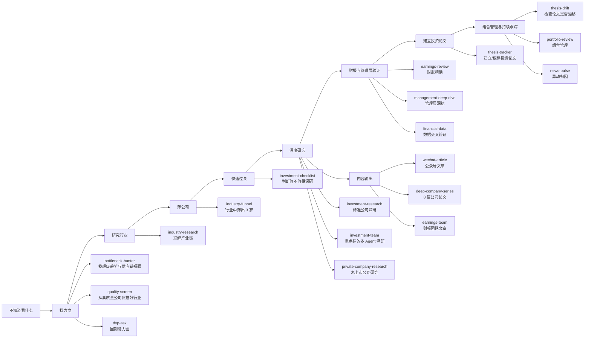
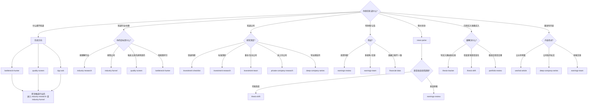

# 19 个投资 Skill 使用地图

> 这张图解决一个问题：**我现在该用哪个 skill？**  
> 不按 19 个平铺记，而是按投资研究的实际路径来用。

---

## 一、总流程：从“不知道看什么”到“买入后跟踪”



---

## 二、决策树：你现在处在哪一步？



---

## 三、最常用的 5 条路径

### 路径 1：我不知道看什么

```text
bottleneck-hunter / quality-screen / dyp-ask
    ↓
industry-research
    ↓
industry-funnel
    ↓
investment-checklist
    ↓
investment-research
```

适合：你没有明确行业，只想从市场里找机会。

---

### 路径 2：我已经知道行业

```text
industry-research
    ↓
industry-funnel
    ↓
investment-checklist
    ↓
investment-research
```

适合：你知道方向，比如机器人、电力设备、GLP-1、AI 基建，但不知道买哪家公司。

---

### 路径 3：我已经知道公司

```text
investment-checklist
    ↓
investment-research
    ↓
earnings-review
    ↓
management-deep-dive
    ↓
thesis-tracker
```

适合：你已经有公司名，想判断能不能买、什么价格买、风险是什么。

---

### 路径 4：我准备重仓

```text
investment-team
    ↓
earnings-review
    ↓
management-deep-dive
    ↓
thesis-tracker
    ↓
portfolio-review
```

适合：你已经很重视这家公司，需要更严谨的研究和买入后纪律。

---

### 路径 5：股价突然大涨/大跌

```text
news-pulse
    ↓
thesis-drift
    ↓
earnings-review / investment-research
```

适合：股价异动时判断是情绪、事件、政策，还是基本面真的变了。

---

## 四、19 个 Skill 分组速查

| 阶段 | Skill | 主要问题 | 结果 |
|---|---|---|---|
| 找方向 | `bottleneck-hunter` | 未来哪里有供应链瓶颈？ | 候选主题/瓶颈地图 |
| 找方向 | `quality-screen` | 哪些行业聚集好公司？ | 排除差公司/发现高质量方向 |
| 找方向 | `dyp-ask` | 我能力圈里有什么好生意？ | 段永平式判断 |
| 行业研究 | `industry-research` | 这个行业怎么赚钱？ | 产业链全景 |
| 行业筛选 | `industry-funnel` | 这个行业哪 3 家最值得研究？ | 候选公司名单 |
| 公司初筛 | `investment-checklist` | 值不值得继续深研？ | 通过/观察/打回 |
| 公司深研 | `investment-research` | 这家公司是否值得买？ | 标准投资报告 |
| 公司深研 | `investment-team` | 复杂/重点公司是否值得重仓？ | 多 Agent 深研报告 |
| 公司深研 | `private-company-research` | 未上市公司怎么看？ | 私有公司研究报告 |
| 公司内容 | `deep-company-series` | 如何系统写透一家公司？ | 8 篇长文系列 |
| 财报 | `earnings-review` | 财报强化还是削弱投资逻辑？ | 财报精读报告 |
| 财报 | `earnings-team` | 财报能否写成可发布文章？ | 多视角财报文章 |
| 管理层 | `management-deep-dive` | 管理层是否值得托付？ | 管理层研究 |
| 数据 | `financial-data` | 财务数据口径是否可靠？ | 交叉验证结论 |
| 异动 | `news-pulse` | 股价为什么动？ | 事件时间线/主因 |
| 买入后 | `thesis-tracker` | 买入理由和红线是什么？ | 投资论文系统 |
| 买入后 | `thesis-drift` | 我的逻辑是否漂移？ | 漂移检测报告 |
| 组合 | `portfolio-review` | 我的持仓结构是否合理？ | 组合优化建议 |
| 发布 | `wechat-article` | 怎么写成读者看得懂的文章？ | 公众号文章 |

---

## 五、最简单记忆版

```text
不知道看什么：bottleneck-hunter / quality-screen / dyp-ask
知道行业：industry-research / industry-funnel
知道公司：investment-checklist / investment-research / investment-team
有财报：earnings-review / earnings-team
看管理层：management-deep-dive
股价异动：news-pulse
买入后：thesis-tracker / thesis-drift / portfolio-review
要发布：wechat-article / deep-company-series
数据校验：financial-data
```

---

## 六、我的建议

日常不要从 19 个里面硬选。你只要先判断自己属于哪一类：

```text
1. 不知道看什么
2. 知道行业
3. 知道公司
4. 有财报
5. 股价异动
6. 已经买入
7. 要写文章
```

然后按上面的决策树选 skill 就行。
