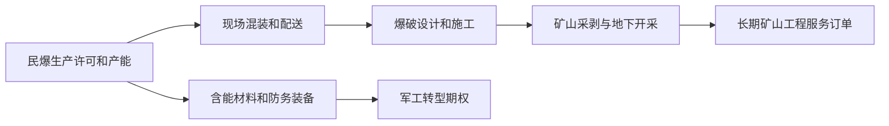

# 广东宏大（002683.SZ）研究报告

**研究日期 / 数据截止**：2026-07-09  
**行情基准**：2026-07-09 16:14:15，腾讯行情显示收盘价 **28.34 元**  
**当前市值**：约 **215.35 亿元**；总股本约 **7.599 亿股**  
**估值速览**：按 2025 年 EPS 约 **1.259 元**，PE **22.51x**；按 BVPS 约 **9.242 元**，PB **3.07x**；按近年分红测算股息率约 **2.28%**  
**一句话论文**：广东宏大不是简单的“炸药股”，而是“民爆牌照 + 矿山服务一体化 + 防务转型期权”的强监管工程平台；它有真实壁垒和行业整合红利，但当前估值已经要求管理层持续证明现金流、并购整合和防务兑现能力。

> **结论先行**：广东宏大属于“有门槛但不轻松”的生意。空仓投资者不宜把它当成确定性消费型复利资产追高；更合理的动作是纳入观察池，等待现金流改善、并购协同验证或估值回到更有安全边际的位置。已有持仓者可继续持有但必须盯紧应收、商誉、安全生产和防务订单兑现。

---

## AI研究偏见自觉

| 项目 | 判断 |
|---|---|
| 信息丰富度评级 | **A级：信息较充裕**。公司为 A 股上市公司，年报、季报、交易所公告、行业政策和同业数据较多。 |
| 主要偏见风险 | 资料多容易产生“确定性幻觉”；防务装备容易被叙事放大；收入并表容易掩盖归母利润和现金流质量。 |
| 本报告处理方式 | 重点做反面检验：把收入增长拆成归母利润、现金流、少数股东权益、商誉和应收账款；把防务板块按“期权”而非确定现金流处理。 |
| 数据局限 | 财务 Agent 超时，财务章节由 team-lead 基于公司公告、东方财富/新浪摘要、腾讯行情和项目工具补齐；部分 2022-2024 完整序列未逐项抽取原表，报告不作为发布级审计结论。 |

---

## 第一部分：核心数据总览

### 1. 关键经营与财务数据

| 指标 | 2025 年 | 同比 / 说明 | 2026Q1 | 同比 / 说明 |
|---|---:|---:|---:|---:|
| 营业收入 | **203.69 亿元** | **+49.20%** | **43.42 亿元** | **+18.85%** |
| 归母净利润 | **9.57 亿元** | **+6.62%** | **1.03 亿元** | **+10.66%** |
| 经营活动现金流净额 | **22.76 亿元** | 全年较好，但 Q4 集中回款 | **-11.34 亿元** | 同比下降 **131.97%** |
| 总资产 | **339.36 亿元** | 较 2024 年末 +72.68% | 未在本报告逐项复核 | — |
| 归母净资产 | **70.23 亿元** | 商誉占比偏高 | 未在本报告逐项复核 | — |
| 商誉账面价值 | **34.42 亿元** | 约占归母净资产 **49%** | 未在本报告逐项复核 | 并购整合核心风险 |
| 应收账款账面价值 | **41.65 亿元** | 约占收入 **20.45%** | 未在本报告逐项复核 | 回款风险指标 |
| 合同资产账面价值 | **18.89 亿元** | 应收+合同资产约占收入 **29.7%** | 未在本报告逐项复核 | 工程业务特征 |

**数据来源**：广东宏大 2025 年年度报告摘要、2025 年审计报告、2026 年第一季度报告；东方财富对 2026Q1 数据报道与季报一致；项目工具对收入和利润做了交叉验证。

### 2. 2025 年业务结构

| 板块 | 2025 收入 | 收入占比 | 同比 | 毛利率 | 判断 |
|---|---:|---:|---:|---:|---|
| 矿山开采 / 矿服 | **144.37 亿元** | **70.88%** | **+33.54%** | **18.24%** | 最大收入基本盘，项目制、回款和安全管理是关键 |
| 民爆器材销售 | **29.93 亿元** | **14.69%** | **+29.63%** | **38.30%** | 高毛利上游环节，牌照与区域供给形成壁垒 |
| 防务装备 | **4.61 亿元** | **2.26%** | **+31.64%** | 约 **41.6%**（测算口径） | 当前体量小，应作为期权处理 |
| 能化业务 | **23.14 亿元** | **11.36%** | 新增并表 | **11.07%** | 雪峰科技并表带来上游硝酸铵协同，也带来周期和整合风险 |
| 其他 | **1.64 亿元** | **0.80%** | **-9.73%** | 约 **15.8%** | 非核心 |

### 3. 当前估值工具验算

项目工具 `tools/financial_rigor.py` 输出摘要：

| 验算项目 | 输入 | 输出 |
|---|---|---|
| 市值验算 | 股价 **28.34 元** × 总股本 **759,885,063 股** | 计算市值 **21.54B CNY**，与行情市值 **21.54B CNY** 偏差 **0.00%** |
| 估值验算 | EPS **1.259 元**，BVPS **9.242 元**，股息 **0.645 元** | PE **22.51x**，PB **3.07x**，ROE 口径 **13.62%**，股息率 **2.28%** |
| 收入交叉验证 | 公司年报、年报摘要、公司官网 | 2025 收入 **203.69 亿元**，偏差 **0.00%** |
| 净利润交叉验证 | 公司年报、年报摘要、东方财富摘要 | 2025 归母净利润 **9.57 亿元**，偏差 **0.00%** |

---

## 第二部分：生意本质分析

### 一句话定义

> 广东宏大的客户不是买一吨炸药，而是买“安全、合规、稳定、可交付的矿山产能释放能力”。

这家公司核心不是单品化工制造，而是把以下能力叠加：

### 收入和利润的真实驱动

1. **矿服订单规模**：2025 年矿服收入 144.37 亿元，是公司最大收入来源；在手矿服订单逾 380 亿元。  
2. **民爆产能和区域布局**：工业炸药实际许可产能约 70.15 万吨，电子雷管产能约 5224 万发；牌照和区域运输半径构成硬约束。  
3. **现场混装比例提升**：从“卖产品”升级为“产品 + 现场服务 + 爆破方案”，增强客户粘性。  
4. **并购整合**：雪峰科技带来新疆区位、民爆和能化协同；长之琳带来航空零部件能力。但并购也放大商誉、少数股东权益和整合复杂度。  
5. **防务装备兑现**：当前收入占比仅 2.26%，但毛利率和估值叙事弹性高。必须以订单、回款和验收节奏验证。

---

## 第三部分：护城河评估

| 护城河来源 | 强度 | 证据 | 反面检验 |
|---|---:|---|---|
| 监管牌照 | 高 | 民爆生产、销售、运输、爆破服务均需严格许可；行业政策鼓励形成大型一体化集团 | 牌照不等于定价权，同区域仍可能竞争 |
| 规模和区域网络 | 高 | 矿服收入 144.37 亿元，工业炸药产能约 70 万吨级，西部资源区布局增强 | 增长部分依赖并购，整合难度提升 |
| 安全管理 | 高 | 2025 年安全专项费用约 6.75 亿元，培训、隐患整改和高危子公司标准化体系较完整 | 单次重大事故即可显著改变公司风险画像 |
| 客户粘性 | 中高 | 大型矿山项目周期长，爆破方案、现场混装、矿山施工绑定客户 | 大客户议价能力强，项目招投标仍压制利润率 |
| 技术和工程经验 | 中高 | 专利、智能矿山、爆破标准、复杂矿山施工经验 | 工程技术需要持续投入，可被央企/同业追赶 |
| 品牌声誉 | 中 | B2B 高危工程领域，履历和安全记录就是品牌 | 不是消费品牌，难以直接形成溢价 |
| 定价权 | 偏弱至中等 | 民爆产品标准化，矿服项目毛利率约 18.24% | 这是公司最大短板，不是“躺着赚钱”的生意 |

**综合判断**：广东宏大有真实进入壁垒，但不是顶级轻资产、强定价权复利生意。它更像“高门槛、强交付、重管理”的工程平台。

---

## 第四部分：行业与竞争格局

### 1. 民爆行业：低速增长 + 集中度提升

工信部“十四五”民爆规划和 2025 年转型升级实施意见，都指向同一方向：更少企业、更高集中度、更安全、更智能、更一体化。行业目标从形成 3—5 家大型民爆一体化集团，延伸到 2027 年进一步提升无人化和集中度。

行业数据体现出“产值增长有限，但利润改善明显”：2021-2025 年民爆生产企业生产总值从 344.38 亿元增至 394.87 亿元，利润总额从 53.86 亿元增至 93.13 亿元。前十大企业集团生产总值占比从 53.2% 提升至 67.6%。

**结论**：民爆不是高 TAM 爆发行业，而是供给侧整合和服务链延伸行业。

### 2. 电子雷管和现场混装

电子雷管替代传统雷管已基本完成，2025 年电子雷管占工业雷管产量约 93.3%。这意味着后续增长不能再简单按渗透率红利外推，而要看需求、价格、质量、牌照和产能动态调整。

现场混装更重要。它把民爆产品嵌入矿山现场，形成“产品 + 设备 + 人员 + 方案 + 安全责任”的综合服务接口，是公司从卖炸药走向矿服一体化的关键。

### 3. 竞争对手对比

| 公司 | 2025 年经营特征 | 相对优势 | 对广东宏大的威胁 |
|---|---|---|---|
| 易普力 | 营收约 98.32 亿元，归母净利约 7.93 亿元 | 中国能建体系、央企工程协同、民爆一体化 | 大型矿服和爆破服务直接竞争 |
| 国泰集团 | 营收约 23.61 亿元，归母净利约 2.52 亿元 | 江西区域民爆龙头，含能材料延伸 | 区域性强，规模小于广东宏大 |
| 江南化工 | 营收约 99.82 亿元，归母净利约 7.58 亿元 | 民爆 + 爆破工程 + 新能源 | 业务更分散，民爆矿服纯度低于广东宏大 |
| 雅化集团 | 营收约 85.43 亿元，归母净利约 6.32 亿元，民爆收入约 33.16 亿元 | 锂 + 民爆双主业，海外矿山布局 | 估值和盈利受锂周期影响更大 |

**广东宏大的相对位置**：矿服体量、民爆一体化、现场混装、西部资源区和防务转型构成组合优势；但易普力等央企平台的工程体系和资源协调能力不可低估。

---

## 第五部分：逆向思考与风险清单

### 最强 Bear Case

> 广东宏大的护城河可能被市场高估：核心利润仍来自重资产、项目制、强周期、弱定价权的矿服与民爆业务；防务装备虽然有故事，但当前收入占比小、确定性不足；并购驱动收入扩张却没有同步转化为归母利润和稳定自由现金流。

### 关键风险排序

| 风险 | 证据 | 影响 | 观察指标 |
|---|---|---|---|
| 商誉和并购整合 | 商誉 **34.42 亿元**，约占归母净资产 **49%**；雪峰科技、长之琳连续并购 | 减值可能吞噬利润和净资产 | 并购标的利润、现金流、业绩承诺、商誉减值测试 |
| 应收和合同资产 | 应收账款 **41.65 亿元**，合同资产 **18.89 亿元** | 工程业务回款变慢会侵蚀利润质量 | 账龄、期后回款、坏账准备、经营现金流 |
| 安全生产 | 民爆、矿服、能化、防务均为高危业务 | 单次事故可影响资质、订单和估值 | 事故、处罚、停产整改、安全投入 |
| 管理层交接 | 2025 年郜洪青接任董事长，郑炳旭任名誉董事长 | 组织能力能否制度化需验证 | ROIC、现金流、并购纪律、人才稳定 |
| 防务信息不透明 | 军工保密导致订单、客户、验收披露有限 | 市场可能过度想象或滞后识别风险 | 防务收入、毛利、回款、研发资本化、审价 |
| 周期风险 | 矿服和民爆受采矿、基建、矿价和财政资金影响 | 订单和回款下行 | 矿价、采矿业投资、民爆销量、价格 |
| 关联交易和国资治理 | 2025 关联交易实际约 **7.45 亿元**，2026 预计约 **7.29 亿元** | 需防范利益输送和非市场化目标 | 交易占比、公允性、资金占用 |
| 海外项目 | 公司推进国际化 | 政治、汇率、税务、治安和合规风险 | 海外收入、回款、安全事件、当地政策 |

---

## 第六部分：管理层与资本配置

广东宏大的治理结构有两面性。

**正面**：广东省环保集团直接持股 24.88%，其全资子公司持股 2.40%，合计 27.28%；国资背景有助于资质、融资、资源协调和大型项目获取。创始/核心管理层仍持有较多股份，利益绑定并未完全消失。公司 2025 年派发 2024 年度及 2025 年半年度现金红利合计约 4.90 亿元，并完成股份回购，股东回报意识提升。

**风险**：2025 年郑炳旭因年龄原因辞任董事长，郜洪青接任。新管理层能否延续工程能力、安全文化、并购纪律和现金流约束，是未来三年比短期收入增速更重要的变量。国资控股也意味着资本配置可能兼顾产业战略、区域协同和保供安全，不一定总以股东 ROIC 最大化为唯一目标。

**资本配置的核心问题**：

1. 雪峰科技 21% 股权取得控制权后，少数股东权益和并表收入如何影响归母利润？  
2. 长之琳 60% 股权收购能否把航空军工供应链能力转化为可审计现金流？  
3. 公司未来是否继续高频并购？并购门槛是战略叙事，还是 ROIC 和现金流？  
4. 分红、回购、债务融资、并购扩张能否在安全资产负债表下同时成立？

---

## 第七部分：估值与安全边际

### 1. 当前价格隐含什么？

以 2026-07-09 收盘价 **28.34 元**计：

- PE 约 **22.5x**；
- PB 约 **3.07x**；
- 市值约 **215.35 亿元**；
- 2025 年归母净利润 **9.57 亿元**，收入 **203.69 亿元**。

这个价格并不便宜。市场显然不只是按传统民爆和矿服工程公司估值，而是给了以下预期：

1. 民爆行业整合继续提升龙头利润率；  
2. 矿服订单能够持续增长且回款可控；  
3. 雪峰科技和长之琳并购协同能够兑现；  
4. 防务装备从小板块成长为可见第二曲线；  
5. 安全生产不发生重大负面事件。

### 2. 三情景估值

项目工具三情景模型，基于当前 EPS **1.259 元**、预测期 3 年：

| 情景 | EPS 年增速 | 目标 PE | 3 年后目标 EPS | 目标价 | 相对 28.34 元涨跌幅 |
|---|---:|---:|---:|---:|---:|
| 乐观 | **18%** | **26x** | **2.07 元** | **53.8 元** | **+89.8%** |
| 中性 | **10%** | **20x** | **1.68 元** | **33.5 元** | **+18.3%** |
| 悲观 | **3%** | **14x** | **1.38 元** | **19.3 元** | **-32.0%** |

**解读**：

- 乐观情景需要防务和矿服同时兑现，且市场继续给较高估值。  
- 中性情景下，三年资本利得只有约 18.3%，加上股息后年化回报不算突出。  
- 悲观情景下，如果成长降速、估值回落或商誉/现金流出问题，回撤可达 30% 以上。

### 3. 行动价格带（非投资建议）

| 投资者类型 | 合理动作 | 价格 / 条件 |
|---|---|---|
| 空仓保守型 | 等待 | **21 元以下**或出现现金流明显改善且估值未上升时再研究买入 |
| 空仓稳健型 | 观察池 | **24-25 元以下**，且 2026 年经营现金流修复、应收账款未恶化、防务订单有实质兑现 |
| 空仓激进型 | 小仓位跟踪 | 现价附近只适合以“行业整合 + 防务期权”小仓试错，必须设定基本面止损条件 |
| 已有持仓 | 持有但严控风险 | 若 Q2-Q4 现金流修复、商誉无减值、防务收入继续增长，可持有；若应收/合同资产继续高增、重大安全事故或并购失控，应减仓 |
| 趋势交易者 | 不在本报告覆盖 | 需要独立技术面和仓位规则，不能用基本面报告替代交易纪律 |

---

## 第八部分：四维评分总表

| 维度 | 框架 | 评分（1-5星） | 核心判断 |
|---|---|---:|---|
| 商业模式与护城河 | 段永平 | ★★★☆☆ | 有牌照、规模和客户粘性，但重资产、项目制、定价权有限 |
| 财务质量与估值 | 巴菲特 | ★★★☆☆ | 收入高增但归母利润增速低，现金流季节性强；现价不便宜 |
| 行业与竞争 | 芒格 | ★★★★☆ | 民爆行业整合和一体化趋势有利龙头，矿服和现场混装是价值迁移方向 |
| 风险与管理层 | 李录 | ★★☆☆☆ | 商誉、应收、管理层交接、安全生产和防务不透明需严肃折价 |

**综合评分：3.0 / 5**  
这不是“回避型差公司”，但也不是“闭眼买入型顶级复利资产”。它更适合放在观察池，通过季度现金流和并购兑现来逐步提高或降低置信度。

---

## 第九部分：巴菲特买入前 Checklist

| # | 检查项 | 通过？ | 说明 |
|---:|---|---|---|
| 1 | 生意能否理解 | 部分通过 | 民爆矿服可理解，防务和军贸不透明度高 |
| 2 | 是否有长期需求 | 通过 | 资源开采、基建、安全爆破和国防需求长期存在 |
| 3 | 是否有护城河 | 通过 | 牌照、安全记录、区域网络和大客户关系构成壁垒 |
| 4 | 是否有强定价权 | 不通过 | 产品同质化和工程招标限制定价权 |
| 5 | 是否轻资产 | 不通过 | 矿服设备、民爆产线、能化、防务研发均偏重资产 |
| 6 | 现金流是否稳定 | 部分通过 | 2025 全年 OCF 好，但 2026Q1 大幅流出，季节性明显 |
| 7 | 管理层是否可靠 | 待验证 | 创始人时代能力强，2025 年交接后需观察新管理层资本配置 |
| 8 | 资产负债表是否安全 | 部分通过 | 国资背景和融资能力较强，但商誉和应收压力不低 |
| 9 | 估值是否便宜 | 不通过 | 22.5x PE 和 3.07x PB 已含成长预期 |
| 10 | 是否有足够安全边际 | 暂不通过 | 现价中性情景回报不突出，需更低价格或更高确定性 |

---

## 第十部分：最终决策与跟踪清单

### 定性判断

| 项目 | 判断 |
|---|---|
| 生意质量 | **中上**：高门槛、强监管、客户粘性，但辛苦、重资产、定价权有限 |
| 行业位置 | **较好**：民爆整合和矿服一体化趋势利好龙头 |
| 管理层 | **待验证**：国资和创始团队基础不错，但董事长交接和并购整合是新考题 |
| 财务质量 | **中等偏谨慎**：利润增长慢于收入，现金流季节性和应收/合同资产需持续跟踪 |
| 估值 | **偏充分**：现价需要防务和并购协同兑现，安全边际不足 |
| 研究动作 | **观察 / 有持仓则审慎持有** |

### 加仓信号

1. 2026 年全年经营现金流明显修复，且不再高度依赖 Q4 单季回款。  
2. 应收账款和合同资产占收入比重下降或稳定，坏账准备未异常上升。  
3. 雪峰科技、长之琳贡献可见归母利润和现金流，商誉减值风险下降。  
4. 防务装备收入、订单和回款有连续披露验证，而不是停留在概念。  
5. 股价回到 **24 元以下**，且基本面未恶化；或回到 **21 元以下**形成明显安全边际。

### 减仓 / 重新审视信号

1. 发生重大安全事故、停产整改或关键资质受影响。  
2. 应收账款、合同资产继续快于收入增长，经营现金流持续为负。  
3. 商誉减值、并购标的业绩承诺落空或少数股东权益显著稀释归母利润。  
4. 防务业务收入增长停滞、研发资本化或审价回款出现异常。  
5. 公司继续大额并购但没有清晰 ROIC 和现金流约束。

---

## AI分析置信度 vs 投资确定性

本报告对“公司是什么生意、行业政策方向、当前估值区间、主要风险”的置信度较高；对“未来三年防务订单兑现、并购协同、自由现金流稳定性”的置信度中等偏低。投资确定性不来自资料数量，而来自商业模式本身、管理层资本配置和可验证现金流。广东宏大目前的关键不是再证明它有故事，而是证明故事能转化为归母利润和自由现金流。

---

## 数据来源与审计记录

### 主要来源

- [广东宏大公司官网](https://www.gdhdkg.com/)  
- [广东宏大公司简介](https://www.gdhdkg.com/show_list.php?id=1)  
- [广东宏大 2025 年年度报告摘要（深交所 PDF）](https://disc.static.szse.cn/download/disc/disk03/finalpage/2026-03-27/d60636d7-4f74-4f94-aa05-f804a7e40e20.PDF)  
- [广东宏大 2025 年年度报告 / 新浪财经公告镜像](https://money.finance.sina.com.cn/corp/view/vCB_AllBulletinDetail.php?id=12021783&stockid=002683)  
- [广东宏大 2025 年审计报告（深交所 PDF）](https://disc.static.szse.cn/download/disc/disk03/finalpage/2026-03-27/50eec613-0e78-46a2-9e5a-a04685396c9a.PDF)  
- [广东宏大 2026 年第一季度报告（深交所 PDF）](https://disc.static.szse.cn/download/disc/disk03/finalpage/2026-04-24/0d51020f-9efe-4800-bd61-f177496440ca.PDF)  
- [东方财富：广东宏大 2026Q1 财报摘要](https://finance.eastmoney.com/a/202604243717586457.html)  
- [工信部：“十四五”民用爆炸物品行业安全发展规划](https://www.miit.gov.cn/cms_files/filemanager/1226211233/attach/20224/720e333bf2794fedb93cecae0f6c20d7.pdf)  
- [民爆行业转型升级政策解读](https://www.ncsti.gov.cn/zcfg/zcjd/202503/t20250304_197287.html)  
- [中国爆破器材行业协会行业数据](https://www.czauto.com.cn/news/detail.php?cid=55)  
- [中国爆破器材行业协会 2026Q1 数据](https://www.czauto.com.cn/news/detail.php?cid=56)  
- [国家统计局固定资产投资数据](https://www.stats.gov.cn/sj/zxfb/202605/t20260518_1963730.html)  
- [上海证券报：2025 年报摘要与关联交易披露](https://paper.cnstock.com/html/2026-03/27/content_2192876.htm)  
- 腾讯行情接口：`qt.gtimg.cn/q=sz002683`，读取时间戳 `20260709161415`。

### 项目工具审计摘要

- 日期基准已用 `date` 命令确认：**Thu Jul 9 23:28:31 2026**。  
- 市值、PE、PB、股息率、三情景估值均用 `tools/financial_rigor.py` 计算。  
- 2025 年收入和归母净利润使用公司年报、公告摘要、官网/东方财富进行交叉验证，关键数值偏差为 **0.00%**。  
- 本报告后续已运行 `tools/report_audit.py extract --dry-run` 进行抽检清单提取：共识别 74 个数据点、抽样 12 个；其中 4 项为日期/年份/阈值噪声，8 项可核验财务或模型数据已用 `tools/report_audit.py verdict` 复核，结果为 **PASS（8/8 通过，0 警告，0 不通过）**。需注意：该准出结果覆盖抽样数据，不等于对全部网页与行业数据做了审计。

**重要声明**：本报告仅用于学习和研究，不构成投资建议。证券价格受宏观、行业、公司经营、市场流动性和投资者情绪等多重因素影响，请自行承担决策责任。

## 看板决策契约

| 字段 | 内容 |
|---|---|
| 契约版本 | 1 |
| 报告类型 | company-fundamental |
| 公司 | guangdong-hongda |
| 股票代码 | 002683.SZ |
| 市场 | A股 |
| 报告日期 | 未给出 |
| 数据截止日 | 2026-07-09 |
| 基本面建议动作 | 观察 |
| 结论摘要 | 生意质量 中上：高门槛、强监管、客户粘性，但辛苦、重资产、定价权有限 |
| 激进型动作 | 小仓位跟踪 |
| 激进型价格区间 | 未给出 |
| 稳健型动作 | 观察池 |
| 稳健型价格区间 | 24-25 元 |
| 保守型动作 | 等待 |
| 保守型价格区间 | 21 元 |
| 买入失效条件 | 未给出 |
| 下次复核日期 | 未给出 |
| 研究置信度 | 待复核 |
