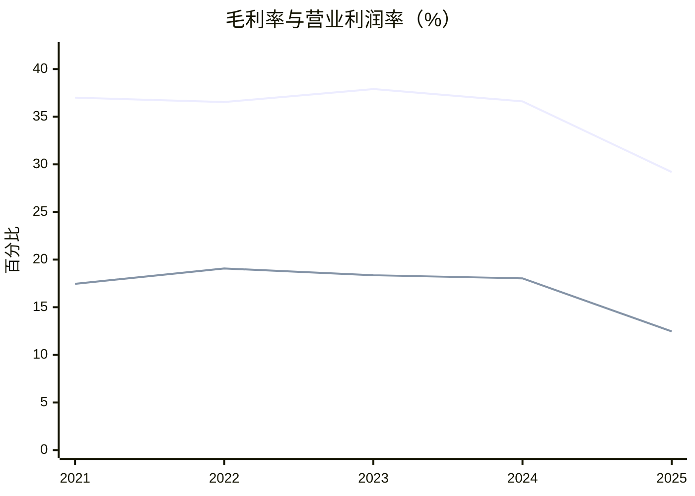
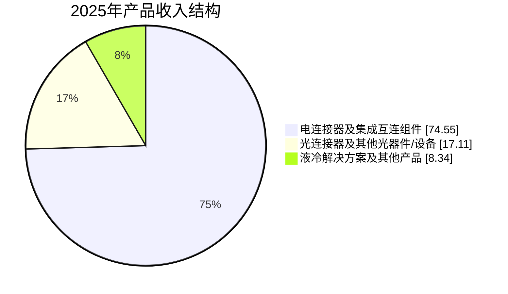

# 中航光电（002179.SZ）研究报告

> **报告日期：** 2026-08-09  
> **数据截止日：** 2026-08-07（行情）；最新财务期为 2026-03-31  
> **收盘价：** ¥35.46  
> **总股本：** 21.0025 亿股  
> **总市值：** ¥744.75 亿元  
> **关键估值：** PE TTM 38.79x；PB 约 3.0–3.2x；PS TTM 3.48x；股息率 1.55%  
> **一句话论文：** 中航光电是国内高可靠互连平台型龙头，但 2025 年利润率与自由现金流断崖式恶化，当前价格已经预付了较强的盈利修复，结论是**观察，而非追买**。

本文为学习与研究记录，不构成投资建议。军品订单、终端客户和部分分行业利润受保密及披露口径限制，估值情景不等同于盈利预测。

---

## AI 研究偏见自觉

**信息丰富度评级：A级（信息充裕，但关键终端数据不透明）。** 公司 2007 年上市，定期报告、投资者交流、同行数据和行业资料丰富；然而防务、汽车、数据中心等终端收入与利润没有分拆，客户名称和订单也大量匿名。资料数量足以高置信度判断财务趋势，却不足以高置信度判断下一轮军品订单和 AI 数据中心利润弹性。

最容易犯的错误有两个：一是把“军工龙头、国产替代、AI 液冷”当成利润必然增长；二是因股价低于 52 周高点，就忽略盈利分母下降后 PE 已升至 38.79x。真正需要反面检验的是：为什么拥有高认证、高研发和高切换成本，2025 年毛利率仍下降 7.42 个百分点？

**AI 研究局限性声明：** 财务报表、股本、股价和公开治理信息已双源核验；军品在手订单、数据中心客户、液冷单独毛利、新园区产能利用率和关联/非关联客户账期缺乏充分披露。报告不会用“合理推测”补齐这些空白。

偏见自查：

- [x] 将资料丰富度与生意确定性分开；财报多不等于拐点可见。
- [x] 把“全球头部客户批量应用”视作待验证线索，而非收入事实。
- [x] 用 2025 年毛利率、FCF 和 2026Q1 利润反证“强定价权”叙事。
- [x] 估值从最新 TTM 盈利出发，不沿用 2023–2024 年高利润锚点。

---

## 第一步：核心数据总览

### 1.1 2021–2025 财务趋势

金额单位为亿元；FCF 定义为经营现金流减购建固定资产、无形资产和其他长期资产支付的现金。2021–2022 归母净利润采用后续年报追溯口径；2023 毛利率采用《企业会计准则解释第 18 号》调整后的可比口径。

| 年度 | 营收 | 归母净利 | 毛利率 | 营业利润率 | CFO | 资本开支 | FCF | 净现金 | ROE |
|---|---:|---:|---:|---:|---:|---:|---:|---:|---:|
| 2021 | 128.67 | 19.92 | 37.00% | 17.46% | 20.62 | 11.19 | 9.43 | 72.09 | 18.22% |
| 2022 | 158.38 | 27.18 | 36.54% | 19.07% | 21.18 | 15.17 | 6.01 | 87.01 | 16.82% |
| 2023 | 200.74 | 33.39 | 37.90% | 18.36% | 30.88 | 23.94 | 6.94 | 85.73 | 17.68% |
| 2024 | 206.86 | 33.54 | 36.61% | 18.03% | 21.50 | 15.43 | 6.07 | 78.23 | 15.67% |
| **2025** | **213.86** | **21.62** | **29.19%** | **12.46%** | **15.62** | **15.82** | **-0.20** | **60.13** | **9.16%** |



趋势非常清楚：2021–2024 的收入和利润扩张在 2025 年断裂。营收仍增长 +3.39%，但归母净利润下降 -35.56%，FCF 转为 -0.20 亿元。公司解释包括防务需求周期波动、客户经济性要求、黄金/铜/白银等原材料上涨以及补缴所得税。利润恶化的核心仍是毛利率下降，而不只是税率波动。

数据来源：[2021 年报](https://static.cninfo.com.cn/finalpage/2022-04-02/1212811420.PDF)、[2022 年报](https://static.cninfo.com.cn/finalpage/2023-03-16/1216129140.PDF)、[2023 年报](https://static.cninfo.com.cn/finalpage/2024-03-16/1219313247.PDF)、[2024 年报](https://static.cninfo.com.cn/finalpage/2025-03-29/1222943981.PDF)、[2025 年报](https://static.cninfo.com.cn/finalpage/2026-03-28/1225044952.PDF)、[东方财富财务分析](https://emweb.securities.eastmoney.com/PC_HSF10/NewFinanceAnalysis/Index?code=SZ002179&type=web)。

### 1.2 2025 年收入结构

| 产品 | 收入 | 占比 | 同比 | 毛利率 | 观察 |
|---|---:|---:|---:|---:|---|
| 电连接器及集成互连组件 | 159.43 | 74.55% | -1.65% | 31.72% | 主体业务，毛利率下降 7.65pct |
| 光连接器及其他光器件/设备 | 36.59 | 17.11% | +28.74% | 23.44% | 增长最快，但毛利低于电连接 |
| 液冷解决方案及其他产品 | 17.85 | 8.34% | +9.25% | 18.41%* | 低于 10%，毛利为接口残差推算 |
| **合计** | **213.86** | **100%** | **+3.39%** | **29.19%** | 低毛利新业务尚未抵消防务波动 |



\* 公司年报未单列第三类毛利率；18.41% 来自东方财富主营构成接口，且等于总成本减前两类成本的残差，属于有据推算而非公司显式披露。境外及港澳台收入 17.98 亿元，占 8.41%，同比 +45.28%，说明国际化提速但基数仍低。前五大客户收入 70.22 亿元，占 32.85%；第一大匿名客户占 10.25%，且为关联方。来源同上年报及[东方财富主营构成](https://emweb.securities.eastmoney.com/PC_HSF10/BusinessAnalysis/PageAjax?code=SZ002179)。

### 1.3 2026 年第一季度：利润拐点仍未出现

| 指标 | 2026Q1 | 同比/解释 |
|---|---:|---|
| 营业收入 | 48.72 亿元 | +0.69% |
| 归母净利润 | 3.98 亿元 | -37.75% |
| 扣非归母净利润 | 3.84 亿元 | -38.95% |
| 毛利率 | 28.00% | 同比约 -0.44pct |
| 营业利润率 | 9.11% | 上年同期 15.32% |
| 研发投入 | 4.84 亿元 | 同比 +48.02%，收入占比 9.94% |
| 经营现金流 | -20.61 亿元 | 同比恶化 83.08%，含明显季节性 |
| FCF | -25.20 亿元 | 一季度不能直接年化 |
| 净现金 | 33.78 亿元 | 资产负债表仍安全，但缓冲继续下降 |

Q1 毛利率仅小幅下降，但销售、管理和研发费用同比分别增长约 +57.79%、+25.03% 和 +48.02%，使营业利润率下降约 6.21 个百分点。公司称数据中心业务高速增长，却未披露收入和毛利，暂不能判断它是否正以较低毛利换规模。[2026 年一季报](https://disc.static.szse.cn/disc/disk03/finalpage/2026-04-25/c5d5cca0-e5cf-4bda-a1f0-634596399390.PDF)，[2026-04-28 投资者交流](https://file.finance.sina.com.cn/cn/diaoyan/jgdy/2026/2026-04/2026-04-29/10178327_1.PDF)。

### 1.4 关键数据双源核验

| 字段 | 公司/交易所 | 独立来源 | 偏差 | 结论 |
|---|---:|---:|---:|---|
| 最新总股本 | 2,100,246,297 股 | 东方财富 2,100,246,297 股 | 0.00% | 通过 |
| 2026-08-07 收盘价 | 新浪 ¥35.46 | 腾讯 ¥35.46 | 0.00% | 通过 |
| 2025 营业收入 | ¥21,386,059,440.13 | 东方财富同值 | 0.00% | 通过 |
| 2025 归母净利润 | ¥2,161,521,950.25 | 东方财富同值 | 0.00% | 通过 |
| 2025 年末货币资金 | ¥7,305,216,976.61 | 东方财富同值 | 0.00% | 通过 |

总股本来源：[回购注销后股本公告信息](https://emweb.eastmoney.com/PC_HSF10/CapitalStockStructure/Index?code=SZ002179&type=soft)；行情来源：[新浪行情](https://hq.sinajs.cn/list=sz002179)、[腾讯行情](https://qt.gtimg.cn/q=sz002179)。2021–2025 各年收入、净利润和货币资金也逐项核验，无未解释的超过 1% 差异。

---

## 第二步：生意本质分析——段永平的“对的生意”

### 一句话定义

**中航光电卖的不是一个标准零件，而是客户在军机、飞机、汽车和服务器中“不能失联、不能漏液、不能失效”的互连可靠性；钱来自项目定点后的随型配套与迭代复购。**

公司拥有 500 多个系列、35 万余种产品，覆盖电、光、流体连接、线缆/EWIS 和设备集成。销售全部直销，生产采用“订单+预测、以销定产”。客户在设计阶段就要共同验证材料、结构、传输、热管理、环境寿命和质量追溯；进入型号或平台后，重新认证的时间成本和失效风险形成复购。[公司官网](https://www.jonhon.cn/)和[2025 年报](https://static.cninfo.com.cn/finalpage/2026-03-28/1225044952.PDF)。

| 商业模式要素 | 机制 | 投资含义 |
|---|---|---|
| 收入性质 | 项目型硬件直销，非订阅 | 复购依赖客户产量、型号寿命和新项目定点 |
| 客户锁定 | 联合设计、认证、可靠性记录、质量追溯 | 军工/航空强，汽车/数据中心相对弱 |
| 定价 | 高可靠产品可获溢价，但客户年度降本和集中采购强势 | 2025 毛利率已证明定价权并非绝对 |
| 成本结构 | 原材料占连接器成本 75.29%，另有高研发和专用设备 | 贵金属、铜价和产能利用率决定利润弹性 |
| 增长变量 | 防务型号节奏、汽车定点转量、AI 高速/液冷、民机交付 | 叙事多，但必须落到收入、毛利和现金回款 |
| 再投资 | 研发占收入 9.78%，资本开支持续较高 | 好生意需要大量再投资，自由现金流并不轻盈 |

这门生意的好处是失效成本远高于零件价格，高可靠场景愿意为验证和交付确定性付费；问题是中航光电正在从高毛利防务向竞争更充分的汽车、光互连和液冷扩张。2025 年产量 +17.97%、销量 +7.55%、库存约 +29.7%，说明新产能和新业务尚未全部转化为高质量销售。

> **段永平式追问：这门生意好在哪？** 可靠性认证和设计导入让客户不敢轻易更换供应商；但如果新增收入主要来自低毛利民品，它仍是“好公司”，却未必保持过去的好经济模型。

---

## 第三步：护城河评估——巴菲特的“经济护城河”

| 护城河来源 | 强度 | 证据 | 反证/可摧毁因素 |
|---|---|---|---|
| 品牌与定价权 | 中 | 防务、高端制造中“专业、可靠、高端”定位 | 2025 总毛利率下降 7.42pct，成本未能完全转嫁 |
| 转换成本 | 强 | 联合设计、整机认证、长期质量追溯、适航和军工资质 | 汽车、通信、数据中心普遍多供并要求年度降本 |
| 网络效应 | 无 | 用户增加不会自动提升其他客户价值 | 不应把产品谱系误称网络效应 |
| 规模/范围效应 | 中强 | 500+ 系列、35 万+ SKU，电光液完整方案，跨行业试验平台 | 全球产能和客户网络远弱于 TE、Amphenol、Molex |
| 技术/专利/标准 | 强 | 6,300+ 授权专利、主持 500+ 标准、参与 400+ 标准、36 项国际标准立项 | 海外专利仅 34 项；专利数量不等于商业回报 |
| 资质与体系入口 | 强 | GJB9001C、AS9100D、IATF16949、NADCAP、CNAS、商飞 QSL | 中航体系依赖也带来关联订单波动和回款约束 |
| 制造学习曲线 | 中 | 60+ 自动化线、1,000+ 台自动化设备、装配自动化率超 50% | 产量快于销量，规模优势可能变成闲置资产 |

研发投入 20.92 亿元，占 2025 收入 9.78%，6,532 名研发人员占员工 33.50%，且研发全部费用化。技术布局包括 224G 高速连接器、UQD/UQDB 液冷、深水湿插拔、空间抗辐照光传输、汽车 Busbar/兆瓦级超充和民机 EWIS。国务院国资委曾披露其高速数据传输技术已在服务器、超算等领域批量应用、历史年销售额超过 3 亿元，说明数通能力并非从零开始；它仍不能替代 2025–2026 AI 数据中心业务的独立收入证据。[国资委技术成果](https://www.sasac.gov.cn/n4470048/n22624391/n26705666/n26757703/c27956641/content.html)。

**过去五年护城河判断：技术、认证和产品范围变宽；利润护城河变窄。** 公司从电连接扩展到光、高速和液冷，并覆盖更多民用赛道，但毛利率和 FCF 说明价值捕获能力弱化。未来五年，护城河能否重新变宽，取决于数据中心/汽车收入能否同时提升规模与毛利，而非仅提升出货。

> **巴菲特式追问：十年后护城河还在吗？** 高可靠认证、工程数据库和型号履历大概率仍在；最可能摧毁它的不是单一竞品，而是产品结构下沉、客户持续压价、国际制裁限制市场，以及重资产扩张长期得不到回报。

---

## 第四步：逆向思考与风险清单——芒格的“反过来想”

### 4.1 失败路径

| 失败路径 | 可能性 | 影响 | 可观察指标 |
|---|---|---|---|
| 防务订单周期低迷超过预期 | 中高 | 高 | 中航体系关联销售、关联应收、季度收入与毛利 |
| 民品增长但产品结构持续稀释毛利 | 高 | 高 | 电连接器毛利率、光/液冷分部毛利、客户降价条款 |
| 新园区利用率不足，资本回报下滑 | 中高 | 高 | 固定资产周转、库存、产销差、增量 ROIC |
| 客户回款继续变慢 | 中 | 高 | CFO/净利润、应收账款/收入、票据与逾期款 |
| 贵金属和铜成本无法转嫁 | 中 | 中高 | 原材料成本占比、季度毛利率、套保和调价机制 |
| AI 液冷/高速连接增量不及叙事 | 中 | 中高 | 数据中心单独收入、重复订单、客户数、毛利率 |
| 新能源汽车价格战压低单车价值 | 高 | 中高 | 定点转量率、车载连接收入与毛利、年度降价 |
| 地缘与清单限制国际化 | 中高 | 中高 | 海外收入、客户准入、出口管制与制裁变化 |
| 重大质量事故或型号资格丢失 | 低 | 极高 | 召回、客户索赔、认证暂停、质量损失 |
| 国资治理目标与股东回报偏离 | 中 | 中 | 关联交易、关联存贷款、低回报投资、激励目标调整 |

### 4.2 最强空头论点

聪明的非买方会说：**这是一家被过去高毛利军品利润锚定的重资产公司。** 2025 年收入 +3.39%，固定资产约 +34%，库存约 +29.7%，但净利润 -35.56%、FCF 转负；2026Q1 利润再跌 -37.75%。所谓 AI 液冷和光连接增长尚未披露独立毛利，完全可能只是用更低利润率替代防务收入。若按 TTM PE 38.79x 买入，投资者实际上在为尚未证明的利润修复付钱。

历史类比上，TE Connectivity 和 Amphenol 的长期优势来自全球客户覆盖、跨行业组合与持续并购整合，而不仅是专利或认证。中航光电更像“国内高可靠冠军向全球平台转型”的中间态。若转型成功，它会更接近全球多元互连平台；若只扩产而价值捕获下降，则会重演许多汽车零部件公司“收入增长、利润被年度降价吞噬”的路径。

### 4.3 最可能的分析错误

- 把军工周期性当成永久性衰退，低估订单恢复；
- 或反过来，把利润下滑全部归因于短周期，忽略民品结构性低毛利；
- 把 400 余项汽车定点当成未来收入，忽略定点取消、放量时间和单车价值；
- 把 35 万 SKU 当作高定价权，忽略长尾定制带来的制造复杂度；
- 用 2024 EPS 1.6091 元计算“低 PE”，而不是用最新 TTM EPS 约 0.9142 元。

> **芒格式追问：我最可能在哪里犯错？** 最大错误是把“技术壁垒强”直接等同于“股东回报率高”。2025 年已经证明，壁垒可以存在，利润率仍会下降。

---

## 第五步：管理层评估——段永平的“对的人”与巴菲特的诚信

### 5.1 控制权、团队与激励

中航科工持股 36.76%，为控股股东；实际控制人为中国航空工业集团。中国空空导弹研究院持股 1.46%，亦由中航工业管理。2026 年 1 月，李森由总经理升任董事长并继续兼任总经理。其经历覆盖研究院、研发管理、规划投资和经营，内部接班连续性好；董事长兼总经理也提高了权力集中度。

现任核心高管多数从研发、制造、防务销售、新能源、财务和供应链内部成长，组织依赖体系而非单一创始人。2026 年 5 月七名高管合计自购约 6.9 万股、252 万元；增持后合计持股约 186.31 万股，占最新股本约 0.089%。信号正面，但经济利益绑定仍弱，公司不是所有者经营型治理。[高管增持公告](https://disc.static.szse.cn/download/disc/disk03/finalpage/2026-05-09/28901e37-b7e9-4c4f-b8be-ee79dcf504fb.PDF)。

第三期限制性股票计划的第三批因公司业绩未达标而取消，2026 年 6 月完成回购注销 1,718.13 万股。调整后 ROE 实际仅 8.91%，低于激励目标 13.8% 等条件。这既确认了 2025 年经营严重偏离目标，也说明考核并非形式化。

### 5.2 资本配置复盘

| 时间 | 决策 | 结果 | 评价 |
|---|---|---|---|
| 2007 起 | 增持沈阳兴华至控制 | 2025 收入 12.98 亿元、净利 1.92 亿元，获单项冠军 | 成功 |
| 2013 | 收购西安富士达并维持控制 | 2025 收入 8.81 亿元、净利 0.88 亿元，北交所上市 | 成功 |
| 2014 | 收购深圳翔通光电 | 建成光器件平台，单独财务回报披露不足 | 待验证 |
| 2017 | 设立泰兴光电布局液冷冷源 | 为当前 AI 液冷产品栈奠定基础 | 战略前瞻，回报待验证 |
| 2024–2025 | 多个产业园投产扩产 | 固定资产显著增长，收入增速低、库存上升 | 当前最大疑问 |
| 2025–2026 | 分红、回购及未达标激励注销 | 已实施现金分红约 11.62 亿元、回购约 1.51 亿元，合计约 13.13 亿元，占 2025 归母净利约 60.76% | 约束与回报意愿尚可 |

2025 年资本开支 15.82 亿元，几乎等于 CFO 15.62 亿元。高端互连科技产业社区、华南产业基地、基础器件产业园和民机与工业互连产业园预算规模大。未来两年必须看产能利用率、固定资产周转和增量 ROIC；“产能建成”不是资本配置成功。

治理风险还包括中航体系关联交易和金融往来。2025 年中航工业体系关联销售约 21.68 亿元；年末在中航财务公司存款约 19.99 亿元、贷款约 8.97 亿元。年报称定价公允，但投资者仍需跟踪关联客户账期和资金独立性。

> **段永平式追问：如果 CEO 退休，公司还能保持竞争力吗？** 大概率能。研发、认证、制造和客户关系已组织化；真正风险不是某个人离任，而是国资治理下资本回报纪律不足，以及国际化人才密度不够。

---

## 第六步：行业与文明趋势——李录的长期框架

连接器不是文明范式本身，而是电气化、数字化、AI 算力、航空航天和智能汽车共同需要的“铆钉与神经接口”。趋势长期向上，但行业增长不保证每个供应商都获得高利润。

公司年报援引行业研究称，2025 年全球连接器市场约 991 亿美元、中国市场约 328 亿美元；该数字未在年报中给出完整第三方模型，应视作公司引用的市场口径而非精确 TAM。更可核验的增量包括：

- 中国信通院测算 2024 年中国智算中心液冷市场 184 亿元，同比 +66.1%，预计 2029 年约 1,300 亿元。[信通院报告](https://www.caict.ac.cn/kxyj/qwfb/ztbg/202508/P020250826611237647336.pdf)
- 工信部披露 2026 年 3 月中国智能算力规模达 1,882 EFLOPS（FP16），显著高于 2025 年 6 月的 788 EFLOPS。[工信部 2026Q1 发布](https://tjca.miit.gov.cn/xwdt/xydt/art/2026/art_756c4a9f4bfc40089d4689a8aa8b7746.html)
- 中国汽车工业协会数据表明 2025 年新能源汽车销量 1,649 万辆，电动化继续扩大高压连接、充换电和智能网联需求。[中国汽车工业协会](https://www.caam.org.cn/)

公司处于产业链中游：上游为铜、黄金、银、工程塑料、光纤与精密加工；下游为防务整机、汽车、服务器、云厂商、运营商和工业设备。利润池由“标准制定+设计导入+可靠性认证+规模交付”共同决定。中航光电在国内防务的价值捕获强，在汽车和数据中心则面对更强的客户议价。

| 赛道 | 趋势 | 中航光电位置 | 关键不确定性 |
|---|---|---|---|
| 防务与商业航天 | 高可靠、轻量化、光电液一体化 | 国内第一梯队、体系入口强 | 订单周期、价格和回款 |
| 新能源汽车 | 高压、超充、智能网联 | 覆盖国内前 15 大车企，2025 定点 400+ | 定点转量、年度降价、海外本地化 |
| AI 数据中心 | 224G、高速铜/光、液冷 | 产品栈完整，已进入头部供应链 | 客户名单、规模收入和毛利未披露 |
| 民机/EWIS | 国产大飞机长期放量 | 进入商飞 QSL、具备批产条件 | 单机价值、适航范围和交付节奏 |
| 低空与具身智能 | 早期快速迭代 | 已有产品和小批量供货表述 | TAM 兑现、竞争与价格 |

地缘风险不可忽略。美国 OFAC 的 NS-CMIC 名单包括 AVIC JONHON，限制美国人士交易特定相关证券；2026 年美国国防部中国军工企业名单也继续列示 AVIC 及包括 JONHON 在内的子公司。二者不等同于全面经营制裁，但会影响海外资本、客户合规和供应链准入。[OFAC 说明](https://ofac.treasury.gov/recent-actions/20210603)，[美国国防部 2026 名单公告](https://www.govinfo.gov/content/pkg/FR-2026-02-17/pdf/2026-02996.pdf)。

> **李录式追问：站在二十年后，这是标准石油还是 3Com？** 更可能是长期存在的高可靠“卖铲人”，不是具备垄断网络效应的标准石油。它能否成为中国版全球互连平台，取决于民品和国际化能否复制军工中的认证、质量和利润优势。

---

## 第七步：估值与安全边际——对的价格

### 7.1 当前定价

以 2026-08-07 收盘价 ¥35.46、最新总股本 21.0025 亿股计算，总市值 ¥744.75 亿元。TTM 归母净利润约 19.20 亿元，EPS 约 ¥0.9142；TTM 收入约 214.20 亿元。

| 指标 | 当前值 | 口径与解读 |
|---|---:|---|
| PE TTM | 38.79x | 盈利收益率仅 2.58%，利润处低谷但尚未确认反转 |
| PB | 约 3.0–3.2x | 2026Q1 报告 BVPS 口径约 3.02x；行情商除息调整约 3.17x |
| PS TTM | 3.48x | 对制造企业不低，必须靠毛利修复 |
| EV/2025 收入 | 约 3.32x | 以 2026Q1 净现金 33.78 亿元计算 |
| 股息率 | 1.55% | 2025 年度每股现金股息 ¥0.55 |
| 2025 FCF 收益率 | 约 -0.03% | 资本开支吞噬 CFO，不具备现金流估值支撑 |
| 2021–2024 平均 P/FCF | 约 104.7x | 四年平均 FCF 约 7.11 亿元，仍很昂贵 |

当前价低于 52 周高点 ¥47.21，但这不等于估值低。盈利下降把 PE 推高；历史估值网站在 2026 年较早时点显示的 PE 区间约 26.77–33.35x，最新 38.79x 已高于该区间，且不同网站的复权与利润口径可能不同。[历史 PE 页面](https://eniu.com/gu/Sz002179)。

同行估值只作横向温度计，不作为内在价值锚：

| 公司 | PE TTM | PB | 2025 毛利率 | 说明 |
|---|---:|---:|---:|---|
| **中航光电** | **38.79x** | **约 3.17x** | **29.19%** | 防务与民品混合，利润低谷 |
| 航天电器 | 158.40x | 4.57x | 30.60% | 2025 利润同样承压 |
| 瑞可达 | 59.55x | 7.13x | 22.15% | 新能源连接增长更快、估值更高 |
| 永贵电器 | 319.70x | 2.31x | 25.03% | 利润低基数，PE 失真严重 |
| 立讯精密 | 25.57x | 5.04x | 11.91% | 全球消费电子/汽车平台，规模差异巨大 |
| 电连技术 | 76.77x | 3.66x | 29.95% | 汽车/消费连接，利润也处波动期 |

同行行情为 2026-08-07 腾讯/东方财富快照；财务来自各公司 2025 年报与[东方财富财务页面](https://emweb.securities.eastmoney.com/PC_HSF10/NewFinanceAnalysis/Index?code=SZ002179&type=web)。极端 PE 主要说明行业盈利分母普遍波动，不能反向证明中航光电便宜。

### 7.2 反向 DCF：市场已经要求什么

2025 FCF 接近零，直接用当年 FCF 做 DCF 会失真。为对公司更有利，先用 2025 归母净利润 21.62 亿元作为“标准化所有者收益”代理，取折现率 10%、永续增长 3%、显性期五年，并以 2026Q1 净现金计算 EV 约 710.97 亿元。精确试算显示，只有当所有者收益未来五年约以 **23% 年增速**增长，模型企业价值才约 708.98 亿元，接近当前 EV。

这是偏乐观的反推，因为实际 2025 FCF 为负。换句话说，当前股价不是在定价“维持现状”，而是在定价防务恢复、民品放量和毛利改善同时发生。

另一种终值直觉：若三年后市场给 25x PE，当前价格要求 EPS 从 ¥0.9142 约增长到 ¥1.42，即年增约 15.7%；若三年后只给 22x，则要求年增约 20.8%。

### 7.3 三情景估值

基准 EPS 使用最新 TTM ¥0.9142，预测期三年。情景不是卖方一致预期，而是检验当前价格需要多强修复。

| 情景 | EPS 年增速 | 三年后 EPS | 目标 PE | 三年后价值 | 相对当前价 |
|---|---:|---:|---:|---:|---:|
| 乐观 | +18% | ¥1.50 | 30x | **¥45.1** | +27.1% |
| 中性 | +10% | ¥1.22 | 24x | **¥29.2** | -17.6% |
| 悲观 | 0% | ¥0.91 | 18x | **¥16.5** | -53.6% |

乐观情景也只有三年累计 +27.1% 的价格空间，股息不足以显著改变风险回报；中性情景已经低于现价。这就是为何结论不是“好公司跌下来就买”。

### 7.4 行动价格带

| 投资者 | 基本面价格带 | 动作 | 必须同时看到的证据 |
|---|---:|---|---|
| 激进型 | ¥29–32 | 小仓分批试仓 | 毛利率停止下降，防务或数据中心至少一个终端出现可核验利润拐点 |
| 稳健型 | ¥24–28 | 分批买入 | TTM EPS 稳定、CFO/净利润回升、库存与应收增速降至收入增速附近 |
| 保守型 | ¥19–22 | 才考虑建立安全边际仓位 | 即便盈利修复延迟，18–22x 低谷 EPS 仍有缓冲 |

当前 ¥35.46 位于三档买入区间之上。下一次关键验证是 2026 年中报：若只是收入增长、毛利和现金流仍弱，不应因“AI 液冷”叙事上调价值；若毛利率回到 31% 以上且经营现金流明显改善，再重估合理。

> **段永平式追问：如果股市明天关闭五年，愿意以这个价格持有吗？** 对已了解业务且能承受周期的人，可以持有但不宜重仓加价；对空仓者，35.46 元缺少足够安全边际，答案是等待。

---

## 第八步：最终决策与行动清单

### 8.1 综合判断

| 维度 | 结论 | 信心度 |
|---|---|---|
| 生意质量（段永平） | 高可靠互连是好生意，但正在从高毛利防务向更竞争的民品迁移 | 中高 |
| 护城河（巴菲特） | 认证、切换成本、工程经验和产品范围强；网络效应不存在 | 高 |
| 管理层（段永平+巴菲特） | 内部接班、技术运营导向；历史并购尚可，当前扩产回报待验 | 中 |
| 最大风险（芒格） | 将利润下滑误判为短周期，低估结构性毛利和现金流下降 | 高 |
| 文明趋势（李录） | 电气化、AI 算力、航空航天长期顺风，但价值捕获不自动发生 | 高 |
| 估值（巴菲特+段永平） | 38.79x TTM PE 预付较强修复，当前缺少安全边际 | 高 |

**最终建议：观察。** 这是“公司质量高于当前投资吸引力”的典型。公司资产负债表安全、技术与认证壁垒真实；但 2025–2026Q1 盈利和现金流尚未见底，当前价要求 15%–23% 级别的持续盈利修复，风险回报不够偏向买方。

| 策略 | 建议 |
|---|---|
| 空仓者 | 不追买；¥29–32 仅适合激进小仓，¥24–28 才进入稳健分批区 |
| 持仓者 | 若成本较低可持有观察，不因短期反弹加仓；重点等 2026 中报验证毛利和现金流 |
| 加仓信号 | 毛利率回到 31% 以上；防务订单/关联销售企稳；CFO/净利润持续改善；库存与应收增速回落 |
| 卖出/减仓信号 | 两季毛利率低于 28%；民品增长仍无法带动利润；新园区低利用率导致 ROIC 继续下降；海外准入显著恶化 |
| 论文失效 | 防务与民品同时失速、质量资格受损，或经营现金流长期不能覆盖资本开支与分红 |

### 8.2 四位大师的模拟点评

> **巴菲特：** 护城河可以来自客户不敢换供应商，但真正的检验是资本回报率。先看利润率和现金流能否恢复，再谈价格便宜。

> **芒格：** 最危险的不是不知道，而是拿 2024 年利润去算今天的 PE。把所有液冷和军工叙事拿掉，只看当前现金流，估值并不低。

> **段永平：** 生意方向是对的，价格还不够对。好公司不代表任何价格都值得买，等证据或等价格，哪个先来都行。

> **李录：** AI、电气化和航空航天是长坡，但连接器利润属于能持续定义标准、进入客户设计并全球交付的人。中国冠军到全球平台之间，还有很长的组织建设。

---

## AI 分析置信度 vs 投资确定性

**AI 分析置信度：中高。** 年报、季报、股本、行情和核心财务已按巨潮/深交所与东方财富、腾讯/新浪交叉验证；2021–2025 关键数据偏差均在 1% 内。管理层履历、控股关系、激励注销和主要资本项目有充分公告证据。

**实际投资确定性：中低。** 军品订单、终端分部利润、液冷客户和毛利、新园区利用率没有充分披露；2026Q1 仍处盈利下降阶段。因此，“护城河仍在”是高置信结论，“利润将在何时、以多大幅度修复”只是有限信息下的情景推理。

基于充分数据的结论：财务恶化、净现金缓冲、股本/市值、产品收入结构、研发投入、客户集中度、激励未达标注销。基于有限信息推理的结论：防务订单恢复节奏、AI 数据中心利润贡献、民机与低空业务的长期价值、新产能的增量 ROIC。

下一次复核重点：2026 年中报中防务订单/关联销售、三类产品毛利率、数据中心收入线索、库存和应收、经营现金流、新园区利用率。

---

## 数据来源与审计记录

主要来源：

1. [中航光电 2025 年年度报告](https://static.cninfo.com.cn/finalpage/2026-03-28/1225044952.PDF)
2. [中航光电 2026 年第一季度报告](https://disc.static.szse.cn/disc/disk03/finalpage/2026-04-25/c5d5cca0-e5cf-4bda-a1f0-634596399390.PDF)
3. [东方财富财务分析与主营构成](https://emweb.securities.eastmoney.com/PC_HSF10/NewFinanceAnalysis/Index?code=SZ002179&type=web)
4. [中航光电官网](https://www.jonhon.cn/)
5. [中国信通院《智算中心液冷产业全景研究》](https://www.caict.ac.cn/kxyj/qwfb/ztbg/202508/P020250826611237647336.pdf)
6. [工信部 2026 年一季度工业和信息化发布](https://tjca.miit.gov.cn/xwdt/xydt/art/2026/art_756c4a9f4bfc40089d4689a8aa8b7746.html)
7. [OFAC NS-CMIC 名单说明](https://ofac.treasury.gov/recent-actions/20210603)

`financial_rigor.py` 关键输出摘录：

```text
市值验算：35.46 × 2,100,246,297 = 74.47B CNY
报告市值：74.47B CNY；偏差 0.00%；验证通过

交叉验证：最新总股本、2026-08-07收盘价、2025营业收入、
2025归母净利润、2025年末货币资金；双源偏差均为 0.00%

估值验算：PE TTM 38.79x；盈利收益率 2.58%；
PS 3.48x；股息率 1.55%；2025 FCF Yield -0.03%

三情景估值：
乐观 18%增长 / 30x PE -> 目标EPS 1.50，目标价 45.1，+27.1%
中性 10%增长 / 24x PE -> 目标EPS 1.22，目标价 29.2，-17.6%
悲观 0%增长 / 18x PE -> 目标EPS 0.91，目标价 16.5，-53.6%

反向DCF试算：标准化所有者收益 21.62 亿元、折现率 10%、
永续增长 3%、显性期 5 年；23%增长对应企业价值约 708.98 亿元，
接近当前企业价值约 710.97 亿元。
```

**随机数据抽检：【准出】。** 全文提取 108 个数值点，以固定随机种子 42 按 15% 比例抽取 17 个；17/17 通过、0 警告、0 不通过。外部事实均使用两项来源或公告与行情交叉核验，模型假设使用 `financial_rigor.py` 与独立复算核对。抽检底稿见 `data/002179/report-audit-20260809.json`。

## 看板决策契约

| 字段 | 内容 |
|---|---|
| 契约版本 | 1 |
| 报告类型 | company-fundamental |
| 公司 | 中航光电科技股份有限公司 |
| 股票代码 | 002179.SZ |
| 市场 | A股 |
| 报告日期 | 2026-08-09 |
| 数据截止日 | 2026-08-07 |
| 基本面建议动作 | 观察 |
| 结论摘要 | 护城河真实但盈利未见拐点，当前估值预付较强修复 |
| 激进型动作 | 毛利企稳后小仓分批试仓 |
| 激进型价格区间 | ¥29–32 |
| 稳健型动作 | 盈利与现金流改善后分批买入 |
| 稳健型价格区间 | ¥24–28 |
| 保守型动作 | 建立安全边际仓位 |
| 保守型价格区间 | ¥19–22 |
| 买入失效条件 | 防务与民品同时失速且毛利率连续两季低于28%，经营现金流长期不能覆盖资本开支 |
| 下次复核日期 | 2026-08-28 |
| 研究置信度 | 中 |
