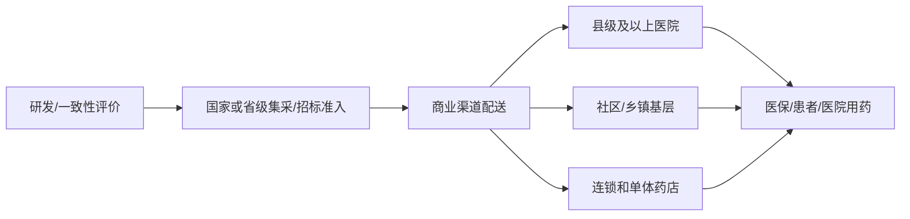

# 国药现代（600420.SH）business-analyst 维度报告

**角色**：business-analyst（段永平视角：商业模式、护城河、用户价值）  
**公司**：上海现代制药股份有限公司 / 国药现代（600420.SH）  
**资料截止**：2026-07-08 20:09（Asia/Shanghai，本机 `Get-Date` 确认）  
**信息丰富度评级**：A 级。公开资料充足，但本报告刻意做反面检验：不把“国药集团平台、品种多、集采中选多”直接等同于强护城河。  
**边界**：本报告只交付商业模式维度，不写最终投资建议，不做估值结论。

---

## 3-5 条核心结论

1. **国药现代的本质不是“品牌药企”，而是“央企化学制药工业平台 + 原料药/中间体/制剂一体化的保供型仿制药生意”。** 2025 年原料药及中间体收入 44.76 亿元、制剂收入 46.22 亿元，二者合计几乎构成全部主业。
2. **它创造的用户价值是真实的：为医院和集采体系提供通过一致性评价、可规模供货、成本可控的基础药品。** 但这种价值更多被医保/医院/患者分享，未必沉淀为企业定价权。
3. **最强能力是“体系能力”：国药集团资源、国药控股渠道、国药医工总院/国药工程研发工艺协同、原料药到制剂链条。** 这能帮助它活下来、拿份额、控成本，但不自动产生高毛利护城河。
4. **最大的反面证据是：销量增长仍可能伴随价格和毛利率下行。** 2025 年多个核心原料药销量提升，但原料药及中间体板块毛利率下降 9.15 个百分点；2026Q1 披露原料药及中间体毛利率从上年同期 32.65% 降至 15.35%。
5. **段永平“好生意”标准下，国药现代更像“重要但辛苦的生意”，不是天然轻松赚钱的生意。** 差异化、转换成本、定价权均偏弱；优势在规模、合规、质量、渠道与集团协同。

---

## 一、商业模式本质：核心生意定义与收入结构

### 1.1 一句话定义

> 国药现代卖的是**通过监管质量门槛、可规模供应、成本受控的化学仿制药与上游原料药能力**；客户买单的核心理由不是“独特疗效”，而是“合规、稳定、可及、价格符合集采规则”。

这句话里有两个关键点：

- **钱从哪里来**：医院、基层终端、药店、药品商业公司、海外药企/贸易商，最终由医保、患者和医疗机构支付体系承接。
- **利润由什么决定**：不是单纯销量，而是“中选价格/原料药价格 - 规模化制造成本 - 质量合规成本 - 集采/渠道履约成本”。在集采常态化下，价格变量经常比销量变量更强。

### 1.2 2025 年收入结构拆解

| 口径 | 2025收入 | 占营业收入 | 同比 | 毛利率 | 商业含义 |
|---|---:|---:|---:|---:|---|
| 原料药及医药中间体 | 44.76 亿元 | 47.8% | -13.89% | 24.71% | 上游规模与成本底盘；受抗生素产能过剩、海外本土化、终端制剂降价传导影响明显 |
| 制剂 | 46.22 亿元 | 49.4% | -15.21% | 42.06% | 面向院内/基层/零售终端，集采中选有助份额，但价格/费用模式转变压缩收入 |
| 大健康 | 0.38 亿元 | 0.4% | +81.58% | 25.46% | 体量小，暂不构成核心商业模式 |
| 公司营业收入 | 93.63 亿元 | 100% | -14.39% | 综合毛利率 32.43% | 主业仍是化学制药工业，且 2025 明显承压 |

**产品维度（2025）**

| 产品/治疗领域 | 收入 | 占营业收入 | 同比 | 毛利率 | 观察 |
|---|---:|---:|---:|---:|---|
| 全身用抗感染药 | 17.26 亿元 | 18.4% | -17.45% | 26.25% | 大品种基础盘，但需求疲软、价格压力强 |
| 心血管系统用药 | 7.06 亿元 | 7.5% | +5.38% | 52.72% | 相对更好的品类；公司披露“以价换量”带动硝苯地平控释片等增长 |
| 神经系统用药 | 5.16 亿元 | 5.5% | -18.79% | 70.77% | 毛利率高但受竞争和“四同政策”等影响 |
| 泌尿生殖系统用药及激素制剂 | 4.43 亿元 | 4.7% | -15.41% | 48.01% | 专科品类，有一定复杂度 |
| 骨骼肌肉系统用药 | 3.63 亿元 | 3.9% | -5.03% | 73.03% | 毛利较高，但收入体量有限 |
| 呼吸系统用药 | 1.87 亿元 | 2.0% | -30.11% | 43.04% | 受复方甘草片原料配额减少等因素影响 |

### 1.3 销售模式与区域结构

| 口径 | 2025收入 | 占营业收入 | 同比 | 含义 |
|---|---:|---:|---:|---|
| 经销 | 73.26 亿元 | 78.2% | -7.53% | 仍高度依赖商业渠道配送和终端覆盖 |
| 直销 | 18.92 亿元 | 20.2% | -33.54% | 原料药/部分客户直供，但波动更大 |
| 海外地区 | 19.09 亿元 | 20.4% | -26.11% | 国际化认证是真资产，但外需/贸易保护/本土化冲击明显 |
| 华东地区 | 23.50 亿元 | 25.1% | -16.03% | 国内核心区域之一 |

**商业模式判断**：这不是一个“消费者主动指定品牌、企业拥有强提价权”的生意；更像“多品种、强合规、强履约、低成本制造 + 集采准入”的工业生意。它的优秀与否，要看在降价周期中是否还能保持成本优势、质量稳定和现金回收，而不是只看中选数量。

---

## 二、产品、渠道、集团协同如何运转

### 2.1 产品端：从“品种数量”到“产品组合”

| 资产/能力 | 公开数据 | 如何运转 | 反面检验 |
|---|---:|---|---|
| 药品批准文号 | 1,309 个 | 提供广覆盖产品池，可参与多轮国家/省级集采及基层市场 | 文号多不等于盈利强；低价同质品种会消耗管理复杂度 |
| 在产品规 | 651 个药品品规 | 形成多治疗领域供应能力，降低单一品种波动 | 多品种组合可能分散研发/营销资源 |
| 通过一致性评价项目 | 156 个（含视同） | 进入集采、院内准入、质量替代的基本门票 | 一致性评价是必要门槛，不是排他壁垒；通过者越多，价格越卷 |
| 五大核心领域 | 抗感染、心血管、麻醉及精神、抗肿瘤及免疫调节、代谢及内分泌 | 共用研发、生产、准入和学术资源 | 多领域不一定产生协同，需看龙头品种是否真正形成利润池 |

### 2.2 渠道端：集采准入 + 商业配送 + 终端覆盖

制剂业务的典型路径是：

公司年报披露其制剂营销组织覆盖“招标准入、市场学术、品牌建设、商业渠道、终端管理”，并与全国主流药品经销商建立合作，覆盖县级及以上医疗机构、社区和乡镇卫生院、零售药店。

**关键判断**：渠道覆盖是进入市场的能力，但在药品集采框架下，渠道很难像消费品渠道那样变成强价格权。渠道的价值更多体现在履约、保供、终端触达和份额维持。

### 2.3 集团协同：真实但要分清“协同”和“护城河”

| 协同来源 | 具体机制 | 商业价值 | 局限 |
|---|---|---|---|
| 国药控股商业协同 | 工商协同、互联互通、配送与终端触达 | 增强准入和履约可靠性，降低渠道摩擦 | 渠道不是独占，医院采购仍受政策和价格约束 |
| 国药医工总院/国药工程 | 工研协同、工艺开发、技术改造 | 提升研发、工艺、质量体系能力 | 多数仿制药最终仍会被价格竞争检验 |
| 集团产业链供应链 | 工工协同、统一采购、内部资源整合 | 原料药+制剂协同，增强成本和供应稳定 | 上游产能过剩时，内部链条不一定能抵消价格下行 |
| 央企平台信用 | 质量、合规、保供形象 | 对医院和集采体系有信用加分 | 信用加分不等于产品可持续溢价 |

---

## 三、护城河逐项验证

评分口径：1=弱，2=偏弱，3=中等，4=强，5=极强。这里按“能否长期保护超额利润”评分，而不是按“企业规模/重要性”评分。

| 护城河维度 | 评分 | 支持证据 | 反面证据 | 结论 |
|---|---:|---|---|---|
| 品牌 | 2.5/5 | 拥有“欣然、达力芬、达力新、达力先、威奇达、申洛、浦乐齐”等品牌，央企质量形象较强 | 仿制药院内采购更多由准入、价格、质量和配送决定，患者品牌心智弱于消费医疗或创新药 | 品牌是准入信用，不是强定价权 |
| 转换成本 | 2/5 | 医院和原料药客户对质量体系、稳定供货有一定黏性；API客户验证周期形成一定摩擦 | 集采中标/续标和一致性评价降低替代门槛，同通用名产品可替代性高 | 有履约型转换成本，但不高 |
| 网络/渠道 | 3/5 | 与全国主流经销商合作；借国药控股推进工商协同；覆盖医院、基层和药店 | 渠道不是独占资源；集采价格和中选资格是更关键变量 | 渠道增强份额稳定，不形成网络效应 |
| 规模效应 | 3.5/5 | 93.63亿元收入、651个在产品规、多个大品种销量增长；统一采购率47.24%；原料药+制剂一体化 | 2025收入与毛利率下降，说明规模未能完全抵抗价格周期；2026Q1原料药毛利率大幅下降 | 规模是生存优势，不是轻松赚钱优势 |
| 技术/质量壁垒 | 3.5/5 | 156个一致性评价项目；FDA、欧洲CEP、WHO-PQ、澳大利亚等认证；2025年45项生产/补充申请批件 | 多数属于仿制药/工艺/质量壁垒，专利型排他弱；同行也能通过一致性评价 | 质量壁垒中等偏强，但经济租有限 |
| 监管/保供壁垒 | 3/5 | 集采体系偏好质量稳定、规模供货、低价履约企业 | 政策同样压低价格；保供义务可能牺牲利润率 | 有准入壁垒，也有利润压制 |

**护城河总评：2.9/5。** 这是一个“有工业体系壁垒、但缺少强定价权”的生意。若只按国药集团平台和产品数量打高分，会高估其经济护城河。

---

## 四、客户价值：对医院、基层、患者、集采体系创造什么价值

| 客户/系统 | 国药现代提供的价值 | 为什么客户需要 | 价值是否能转化为公司利润 |
|---|---|---|---|
| 医院 | 通过一致性评价的常用药、稳定配送、质量合规、减少断供风险 | 医院需要满足临床用药与医保控费双重要求 | 中等偏低。医院价值真实，但采购价格由集采和竞价决定 |
| 基层医疗机构 | 常见慢病、抗感染、基础注射剂等可及供应 | 基层更重视可及、价格、配送和品牌信用 | 中等。覆盖广带来份额，但基层支付能力和控费更强 |
| 患者 | 更低价格获得质量可比的仿制药；常用药可及性提升 | 患者受益于集采降价和供应稳定 | 偏低。患者受益大，但企业未必保留超额利润 |
| 集采/医保体系 | 低价、可规模交付、质量过关、减少供应风险 | 医保目标是控费和保供，偏好央企/大厂履约能力 | 低到中等。企业以价换量，利润取决于成本控制 |
| 药品商业公司 | 稳定货源、规模配送、集团内工商协同 | 商业公司需要周转和品种组合 | 中等。协同有助效率，但渠道利润薄 |
| 海外客户 | API/中间体/制剂国际认证、稳定供应 | 海外客户需要合规供应链备选 | 不稳定。2025海外收入下降说明外部周期和贸易政策影响明显 |

**段永平式问题**：用户是不是非买它不可？  
回答：**多数时候不是。** 医院和医保需要“合格、便宜、稳定”的产品，不一定非要国药现代；国药现代的优势是更可能成为合格供应商之一，并在大规模供货中保持稳定，而不是拥有不可替代的用户心智。

---

## 五、业务矩阵与协同

| 业务板块 | 角色定位 | 协同对象 | 主要价值 | 主要风险 |
|---|---|---|---|---|
| 抗感染原料药/中间体 | 上游规模底盘 | 抗感染制剂、海外客户 | 形成成本和供应链控制，支撑头孢、青霉素等链条 | 抗生素产能过剩、价格下行、海外保护主义 |
| 化学制剂 | 终端收入与份额载体 | 医院/基层/零售/国药控股 | 通过集采和终端覆盖变现产品批文与质量能力 | 集采续标降价、四同政策、同质竞争 |
| 心血管用药 | 相对韧性品类 | 慢病基层市场、制剂渠道 | 2025实现正增长，体现“以价换量”可行性 | 正增长若依赖降价换量，需观察利润弹性 |
| 麻醉及精神/神经系统 | 高毛利潜力品类 | 专科院内市场 | 高毛利率品种可改善结构 | 竞争加剧、政策与准入限制 |
| 抗肿瘤及免疫调节 | 结构升级方向 | 研发平台、院内终端 | 理论上更高技术和专科价值 | 2025收入下降，当前体量仍小 |
| 大健康 | 非核心补充 | 品牌消费、渠道尝试 | 可探索第二曲线 | 当前收入不足以影响公司质量判断 |

**协同结论**：国药现代真正的协同不是“业务越多越好”，而是三个闭环：

1. **原料药 + 制剂**：控制成本和质量源头；
2. **研发/一致性评价 + 集采准入**：把批文变成可销售产品；
3. **集团商业渠道 + 终端履约**：把中选份额转化为真实配送与回款。

但这三个闭环都更像“提高存活率和份额稳定性”，不是“提高价格权”。

---

## 六、段永平“好生意”标准评估

| 标准 | 评分 | 判断 |
|---|---:|---|
| 差异化 | 2.5/5 | 在质量、渠道、集团协同上有差异；在多数仿制药疗效和通用名层面差异有限 |
| 定价权 | 1.5/5 | 集采、医保控费、同质竞争压制价格；2025与2026Q1毛利率变化说明定价权偏弱 |
| 可持续竞争优势 | 3/5 | 规模、合规、质量体系、集团协同可持续；但超额利润可持续性不足 |
| 用户价值 | 4/5 | 对医保控费、医院保供、患者可及性价值明确 |
| 股东价值转化 | 2.5/5 | 用户价值未必完全转化为企业利润，关键看成本曲线和产品结构升级 |
| 业务可理解性 | 4/5 | 生意逻辑清晰：合规制造、集采准入、规模保供 |
| 赚钱轻松程度 | 2/5 | 需要持续降本、研发申报、质量合规和集采博弈，属于辛苦钱 |

**综合 business-analyst 评分：2.9/5。**  
如果用段永平的语言，这家公司更像“社会需要、体系能力强、但竞争残酷且价格权弱”的生意。它可能是药品供应体系中的重要公司，但“重要”不等于“好生意”。

---

## 七、反面检验：最容易犯的三个分析错误

| 可能错误 | 为什么诱人 | 反证/校正 |
|---|---|---|
| 把“国药集团平台”直接等同于强护城河 | 央企平台、资源协同、渠道覆盖听起来很强 | 价格由集采和同质竞争决定；集团协同提高履约和成本效率，不必然提高利润率 |
| 把“中选多”直接等同于增长 | 集采中选带来份额和确定销量 | 中选常伴随降价；以价换量需要看毛利率和现金流是否守住 |
| 把“文号多/品种多”当成产品力 | 1,309个批准文号、651个在产品规规模可观 | 多品种也可能意味着管理复杂度、低效长尾和利润稀释 |

**本维度最重要的跟踪指标**：

1. 原料药及中间体毛利率能否从 2026Q1 的低位恢复；
2. 制剂集采续标后的价格和毛利率是否继续下滑；
3. 心血管、麻醉精神、抗肿瘤等非抗感染品类能否真正提高收入占比；
4. 国药控股工商协同是否体现为更高周转、更低费用、更稳回款，而不只是战略口号；
5. 新获批/一致性评价品种是否贡献增量利润，而非只贡献增量收入。

---

## 八、重要来源链接

1. 公司官网：[上海现代制药股份有限公司](https://www.shyndec.com/)  
2. 2025 年报公告页（新浪财经镜像）：[国药现代：2025年度报告](https://money.finance.sina.com.cn/corp/view/vCB_AllBulletinDetail.php?id=12028131&stockid=600420)；PDF：[12028131.PDF](http://file.finance.sina.com.cn/211.154.219.97:9494/MRGG/CNSESH_STOCK/2026/2026-3/2026-03-28/12028131.PDF)  
3. 2026 年一季报公告页（新浪财经镜像）：[国药现代：2026年第一季度报告](https://money.finance.sina.com.cn/corp/view/vCB_AllBulletinDetail.php?id=12275154&stockid=600420)；PDF：[12275154.PDF](http://file.finance.sina.com.cn/211.154.219.97:9494/MRGG/CNSESH_STOCK/2026/2026-4/2026-04-30/12275154.PDF)  
4. 上交所公告检索（用于核验 2026-07-01 一致性评价公告）：[SSE 公告检索](https://query.sse.com.cn/security/stock/queryCompanyBulletin.do?isPagination=true&productId=600420&securityType=0101%2C120100%2C020100%2C020200%2C120200&reportType=ALL&pageHelp.pageSize=25&pageHelp.pageNo=1)  
5. 主流财经数据/年报解读：[同花顺财经：国药现代2025年报](https://stock.10jqka.com.cn/20260330/c675640195.shtml)  
6. 主流行情入口：[东方财富国药现代行情](https://quote.eastmoney.com/sh600420.html)

---

## 审计与资料说明

- 已按项目规则先用 `Get-Date` 确认当前日期；本报告以 2026-07-08 为最新资料截止。
- 年报与一季报 PDF 已下载到 `research/source_docs/国药现代/` 并抽取文本核对关键数据。
- 收入占比由报告披露数用 Decimal 计算，保留一位小数；未使用心算。
- 本报告是 business-analyst 维度报告，不包含最终投资建议或买卖价格区间。
