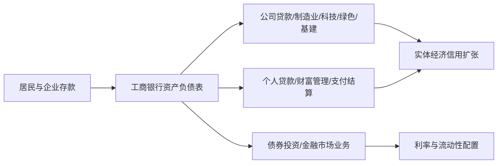

# 工商银行投资研究报告（601398.SH / 01398.HK）

> **数据截止日**：2026-07-07（本地 `date` 命令确认：Tue Jul 7 00:22:38 2026；因当时处于 2026-07-07 盘前/非交易时段，行情采用 2026-07-06 收盘快照）  
> **研究对象映射**：用户输入“工商银行” → 中国工商银行股份有限公司，A 股 601398.SH / H 股 01398.HK；本报告以 A 股人民币估值为主，H 股只作价格参照。  
> **资料来源**：工商银行 2025 年度报告（A 股）、工商银行 2026 年第一季度报告（A 股）、工商银行官网财务报告下载页、东方财富财务/分红接口、腾讯行情、新浪行情、本地 `tools/financial_rigor.py` 精确计算。  
> **用途声明**：本报告仅用于投资研究学习，不构成任何投资建议或收益承诺。

---

## 0. AI 研究偏见自觉

### 信息丰富度评级：A 级（信息充裕）

工商银行是全球系统重要性银行、A/H 两地上市大型国有商业银行，年报、季报、公告、行情、同业数据极其丰富。其优势是财务指标可验证性高，劣势是市场共识强、研究结论容易变成“高股息、低估值、低增长”的模板化复述。

| 维度 | 判断 |
|---|---|
| 信息丰富度 | A 级：公开资料充足、会计口径标准化、同业可比性强 |
| AI 研究陷阱 | 资料越多越容易误把“稳定”和“安全”画等号；银行真实风险常隐藏在资产质量、久期、地方财政与地产链条里 |
| 应对策略 | 不只看 PE/PB/股息率；重点追问息差是否见底、不良是否滞后暴露、资本约束下 ROE 能否维持 |
| AI 研究置信度 | 高：主要历史财务和监管指标来自官方 PDF 与东方财富交叉验证 |
| 投资确定性 | 中：银行资产负债表质量、宏观信用周期、政策利率路径仍非 AI 可完全验证 |

**AI 研究局限性声明**：本报告能较好覆盖公开财务、估值、资本与资产质量指标，但不能替代信贷组合穿透、地方平台与地产项目逐笔风险核查，也无法预测监管政策、利率曲线与宏观信用周期变化。

---

## 1. 数据收集与交叉验证

### 1.1 核心财务快照

单位除特别说明外为人民币亿元。

| 指标 | 2021 | 2022 | 2023 | 2024 | 2025 | 2026Q1 | 主要来源 |
|---|---:|---:|---:|---:|---:|---:|---|
| 营业收入 | 9,427.62 | 8,757.34 | 8,430.70 | 8,218.03 | 8,382.70 | 2,303.70 | 年报/季报、东方财富 |
| 归母净利润 | 3,483.38 | 3,611.32 | 3,639.93 | 3,658.63 | 3,685.62 | 869.41 | 年报/季报、东方财富 |
| 基本 EPS（元） | 0.95 | 0.97 | 0.98 | 0.98 | 1.00 | 0.24 | 年报/季报、东方财富 |
| 每股净资产（元） | 8.15 | 8.81 | 9.55 | 10.23 | 10.83 | 11.06 | 年报/季报、东方财富 |
| 加权 ROE | 12.15% | 11.45% | 10.66% | 9.88% | 9.45% | 8.83%（年化） | 年报/季报、东方财富 |
| 净息差 | 2.11% | 1.92% | 1.61% | 1.42% | 1.28% | 1.29% | 年报/季报、东方财富 |
| 客户贷款及垫款总额 | 206,672.45 | 232,123.12 | 260,864.82 | 283,722.29 | 305,061.14 | 316,482.52 | 年报/季报、东方财富 |
| 客户存款 | 260,797.80 | 294,159.25 | 329,856.81 | 342,776.36 | 368,071.33 | 385,872.03 | 年报/季报、东方财富 |
| 不良贷款率 | 1.42% | 1.38% | 1.36% | 1.34% | 1.31% | 1.31% | 年报/季报、东方财富 |
| 核心一级资本充足率 | 13.31% | 14.04% | 13.72% | 14.10% | 13.57% | 13.26% | 年报/季报、东方财富 |
| 资本充足率 | 18.02% | 19.26% | 19.10% | 19.39% | 18.76% | 18.21% | 年报/季报、东方财富 |
| 总资产 | 351,713.83 | 396,101.46 | 446,970.79 | 488,217.46 | 534,777.73 | 557,725.84 | 年报/季报、东方财富 |

**交叉验证说明**：  
- 2025 年报官方 PDF 披露营业收入 838,270 百万元、归母净利润 368,562 百万元、总资产 53.48 万亿元；东方财富接口同项分别为 8,382.70 亿元、3,685.62 亿元、534,777.73 亿元，折算一致。  
- 2026Q1 官方 PDF 披露营业收入 230,370 百万元、归母净利润 86,941 百万元、总资产 557,725.84 亿元；东方财富接口同项一致。  
- 由于工商银行为银行业公司，传统制造业式“毛利率、自由现金流”不适用；本报告用净息差、成本收入比、拨备覆盖率、资本充足率和 ROE 替代。

### 1.2 收入结构

2025 年，工商银行营业收入 8,382.70 亿元。其中：

| 口径 | 金额 | 占比 | 2024 对比 | 解读 |
|---|---:|---:|---:|---|
| 利息净收入 | 6,351.26 亿元 | 75.8% | 6,374.05 亿元 | 仍是主引擎，但受利率下行压制 |
| 手续费及佣金净收入 | 1,111.71 亿元 | 13.3% | 1,093.97 亿元 | 低基数恢复，改善收入结构 |
| 分部：公司金融业务收入 | 4,106.76 亿元 | 49.0% | 3,939.53 亿元 | 服务实体、制造业、科技金融与对公信贷扩张 |
| 分部：个人金融业务收入 | 3,277.39 亿元 | 39.1% | 3,248.82 亿元 | 零售基础深厚，但居民端收益率承压 |
| 分部：资金业务收入 | 939.90 亿元 | 11.2% | 959.67 亿元 | 债券投资与市场波动共同影响 |

### 1.3 当前行情与估值

| 项目 | A 股 601398 | H 股 01398 | 来源 |
|---|---:|---:|---|
| 最新快照时间 | 2026-07-06 收盘 | 2026-07-06 收盘 | 腾讯行情/新浪行情 |
| 收盘价 | 7.12 元 | 6.43 港元 | 腾讯行情；新浪 A 股同为 7.12 元 |
| 总股本 | 3,564.06 亿股 | 同一总股本；H 股约 867.94 亿股 | 年报/腾讯行情 |
| 总市值 | 25,376.13 亿元 | 港股页面显示约 22,916.92 亿港元（全股本口径） | 腾讯行情 |
| PE | 腾讯口径 6.83x；按 2025 EPS 1.00 元验算为 7.12x | 腾讯港股口径 5.62x | 腾讯行情/工具验算 |
| PB | 腾讯口径 0.65x；按 2025 BVPS 10.83 元验算为 0.66x | 腾讯港股口径 0.63x | 腾讯行情/工具验算 |
| 2025 全年每股现金股息 | 0.3103 元/股（10 派 3.103 元，含税） | H 股分红随人民币派息折算 | 年报/东方财富 |
| A 股静态股息率 | 4.36% | 未在本报告主估值口径计算 | `financial_rigor.py` |

### 1.4 本地精确验算记录

```text
市值验算：7.12 元 × 356,406,257,089 股 = 2.54 万亿元，较腾讯报告市值 2.537613 万亿元偏差 0.00%。
估值验算：PE = 7.12 / 1.00 = 7.12x；PB = 7.12 / 10.83 = 0.66x；股息率 = 0.3103 / 7.12 = 4.36%。
2025 分红率：1,105.93 / 3,685.62 = 30.01%。
```

---

## 2. 生意质量 — 段永平“好生意”视角

### 2.1 这是不是好生意？

工商银行的生意本质不是“高增长金融科技公司”，而是中国信用体系中的超大规模基础设施：吸收低成本存款，把信用分配给企业、居民、政府相关项目，再通过利差、手续费、托管结算和综合金融服务变现。

它的好处是：

1. **客户基础极大**：年报披露服务超 1,400 万对公客户和超 7.8 亿个人客户。  
2. **资金来源稳定**：2025 年客户存款 36.81 万亿元，2026Q1 升至 38.59 万亿元。  
3. **规模经济强**：公司类贷款 2025 年末 18.84 万亿元，对公客户 1,474.59 万户，票据贴现业务量 4.9 万亿元。  
4. **信用成本可吸收性较强**：2025 不良贷款率 1.31%，拨备覆盖率 213.60%，资本充足率 18.76%。

它的坏处也很清楚：

1. **ROE 持续下行**：2021 年 12.15% → 2025 年 9.45% → 2026Q1 年化 8.83%。  
2. **息差持续收窄**：2021 年 2.11% → 2025 年 1.28%，2026Q1 1.29% 只是初步企稳，不能直接认定趋势反转。  
3. **资产增长不等于利润增长**：2021-2025 总资产从 35.17 万亿元增至 53.48 万亿元，但归母净利润仅从 3,483.38 亿元增至 3,685.62 亿元。

### 2.2 关键判断

工商银行是“极强稳定性 + 低增长 + 政策使命嵌入”的生意。它不是典型轻资产高 ROIC 公司，而是以规模、牌照、存款和国家信用背书维持长期存续的金融公用事业。

**段永平式追问**：如果把工商银行看成一门生意而不是股票，我是否愿意接受它未来 5-10 年大概率只有低个位数利润增长、主要回报来自分红和估值修复？

---

## 3. 护城河分析 — 巴菲特“可持续竞争优势”

| 护城河来源 | 强度 | 证据 | 可能削弱因素 |
|---|---|---|---|
| 牌照与系统重要性 | 很强 | 国有大行、G-SIB、监管资本充足 | 政策目标可能优先于股东回报最大化 |
| 低成本存款 | 很强 | 2025 客户存款 36.81 万亿元，2026Q1 38.59 万亿元 | 存款定期化、居民风险偏好变化、互联网渠道竞争 |
| 客户与渠道规模 | 很强 | 超 1,400 万对公客户、超 7.8 亿个人客户、网点 15,434 个 | 年轻客户向新型数字金融平台迁移 |
| 风控与数据积累 | 强 | 长周期信用数据、行业/区域分散组合 | 地方债务、地产链条与宏观下行可能造成模型失效 |
| 品牌信任 | 强 | “宇宙行”心智、国家信用背书 | 若发生重大合规/风险事件，修复成本高 |
| 技术能力 | 中强 | 年报显示推进数字工行、科技强行、自研金融业应用 | 技术更多是效率工具，不是独立定价权来源 |

### 护城河趋势

- **过去 5 年**：存款与客户基础护城河仍宽，但息差下行说明“定价权”弱化；银行间竞争与政策性让利压缩了股东收益。  
- **未来 5 年**：护城河仍在，但从“高 ROE 银行”变成“高稳定性金融基础设施”的概率更高。

**巴菲特式追问**：10 年后这条护城河还在吗？大概率还在；但它能否转化为 12% 以上 ROE？这才是估值能否上台阶的核心。

---

## 4. 逆向思考与风险清单 — 芒格“反过来想”

### 4.1 失败路径

| 失败路径 | 概率 | 影响 | 观察指标 |
|---|---|---|---|
| 净息差继续下行，资产扩张无法弥补 | 中高 | 高 | NIM 是否跌破 1.20%；存款成本与贷款收益率 |
| 地产/地方平台/小微风险滞后暴露 | 中 | 高 | 不良生成率、关注类贷款、逾期贷款、拨备覆盖率 |
| 政策使命压低盈利弹性 | 高 | 中高 | 让利实体、降低贷款利率、分红比例政策 |
| 资本消耗过快，分红增长受限 | 中 | 中 | CET1 是否继续下行、TLAC 工具发行成本 |
| 零售财富和中收恢复不及预期 | 中 | 中 | 手续费及佣金净收入、AUM、代销/托管收入 |
| 市场利率上行导致债券账面波动 | 低中 | 中 | 其他综合收益、金融投资久期和估值波动 |

### 4.2 空方核心论点

1. **低 PB 并不等于便宜**：如果 ROE 从 9% 继续向 7%-8% 滑落，0.6-0.7x PB 可能只是合理折价。  
2. **不良贷款率可能滞后**：大型银行有较强展期、重组和拨备平滑能力，账面不良低不代表信用风险消失。  
3. **股价已不再极端低估**：2026-07-06 A 股价格 7.12 元，已接近 52 周高点 7.74 元，和 2020-2023 的深度折价状态不同。  
4. **高股息不是无风险债券**：分红取决于资本、盈利和监管；本金价格仍会随银行板块估值波动。

### 4.3 历史类比

全球大行在低利率、低增长周期中常呈现“低 PB + 高分红 + 慢增长”状态。优质银行可长期存续并提供现金回报，但估值扩张通常需要两个条件：ROE 稳定回升，且市场相信资产质量没有尾部风险。

**芒格式追问**：我最可能在哪里犯错？最可能是把 2025-2026Q1 的账面资产质量稳定，误读成未来信用成本一定可控。

---

## 5. 管理层评估 — 段永平“对的人” + 巴菲特“管理层诚信”

### 5.1 管理层与治理结构

工商银行的治理不是创始人公司模式，而是大型国有金融机构模式。管理层能力主要体现在：稳资产质量、控资本消耗、服务国家战略、维持分红与市场沟通。

| 人物/机构 | 角色 | 观察点 |
|---|---|---|
| 廖林 | 董事长、法定代表人 | 2025 年报董事长致辞强调服务实体、金融稳定、“五化”转型 |
| 刘珺 | 副董事长、行长；年报中为主管财会工作负责人 | 负责经营执行与财务真实性声明 |
| 中央汇金 | 第一大股东，持股 34.79% | 国家资本代表，稳定性强 |
| 财政部 | 第二大股东，持股 31.14% | 国家信用背书，政策属性强 |
| HKSCC Nominees | H 股名义持有人，24.18% | 反映 H 股公众与机构持股集合 |

### 5.2 资本配置

2025 年工商银行全年普通股现金股息 10 派 3.103 元，合计派息约 1,105.93 亿元，分红率约 30.01%。这说明管理层愿意维持较明确的现金回报，但分红率并未激进提高，背后是资本充足、TLAC、信用风险和政策任务之间的平衡。

### 5.3 关键决策复盘

| 时间 | 决策/行动 | 结果 | 评分 |
|---|---|---|---:|
| 2021-2025 | 推进“五化”转型、数字工行、科技强行 | 资产规模扩大，客户基础稳固，但 ROE 下行 | 7/10 |
| 2025 | 坚持约 30% 分红率并实施中期+末期分红 | 股东现金回报稳定 | 8/10 |
| 2025 | 公司金融支持制造业、科技、绿色、普惠等重点领域 | 与政策方向一致，贷款增长较快 | 7/10 |
| 2026Q1 | 继续扩表，Q1 营收同比 +8.27%、归母净利 +3.31% | 短期经营改善，但资本充足率环比下降 | 7/10 |

**段永平式追问**：如果董事长/行长退休，工商银行还能保持竞争力吗？答案大概率是能，因为真正的护城河来自牌照、客户、系统、资本和国家信用，而非单一经理人。

---

## 6. 行业与文明趋势 — 李录“文明演进框架”

### 6.1 行业位置

银行不是被 AI 原生颠覆最快的行业，但它是现代经济信用分配的核心基础设施。中国式现代化、制造业升级、绿色转型、科技金融、普惠金融、养老金融、数字金融，都需要大型银行提供低成本资金和风控能力。

工商银行在产业价值链中的位置：



### 6.2 文明级趋势判断

| 趋势 | 对工商银行影响 |
|---|---|
| 中国经济从高速增长转向高质量增长 | 资产扩张速度可能下降，但优质信贷筛选更重要 |
| 利率中枢下行 | 压低净息差，对银行 ROE 不利 |
| 数字金融与 AI | 提升运营效率、风控和客户触达，但不一定带来高估值科技属性 |
| 养老金融、财富管理 | 有助于中收恢复，但资本市场景气度影响较大 |
| 金融监管强化 | 降低尾部风险，但也限制高杠杆高收益模式 |

**李录式追问**：站在 20 年后回看，工商银行更像“金融基础设施中的标准石油”，还是“昙花一现的 3Com”？更接近前者——但它的股东回报未必来自高成长，而来自长期现金分红、账面价值累积和低估值买入。

---

## 7. 估值与安全边际

### 7.1 当前估值位置

| 公司   | 代码     |   收盘价 | PE（腾讯口径） | PB（腾讯口径） |   总市值（亿元） |
| ---- | ------ | ----: | -------: | -------: | --------: |
| 工商银行 | 601398 |  7.12 |    6.83x |    0.65x | 25,376.13 |
| 建设银行 | 601939 |  9.67 |    7.40x |    0.71x | 25,296.76 |
| 农业银行 | 601288 |  5.97 |    7.10x |    0.75x | 20,893.99 |
| 中国银行 | 601988 |  5.64 |    7.41x |    0.66x | 18,172.78 |
| 交通银行 | 601328 |  6.64 |    6.09x |    0.50x |  5,867.36 |
| 招商银行 | 600036 | 37.73 |    6.31x |    0.84x |  9,515.45 |

工商银行的估值不贵，但也不是同业中最便宜；它处于“国有大行核心资产 + 高分红 + 接近阶段高位”的组合状态。

### 7.2 三情景估值（3 年，A 股人民币）

使用 2025 EPS 1.00 元、当前价 7.12 元，`financial_rigor.py three-scenario` 输出：

| 情景 | EPS 年增速 | 3 年后 EPS | 目标 PE | 目标价 | 相对当前涨跌幅 | 解释 |
|---|---:|---:|---:|---:|---:|---|
| 乐观 | +3% | 1.09 | 7.5x | 8.2 元 | +15.1% | 息差企稳、资产质量稳定、估值小幅抬升 |
| 中性 | 0% | 1.00 | 6.0x | 6.0 元 | -15.7% | 利润横盘，市场按公用事业银行定价 |
| 悲观 | -3% | 0.91 | 4.8x | 4.4 元 | -38.5% | 息差继续下行、信用成本抬升、PB 下修 |

### 7.3 PB-ROE 框架下的安全边际

2025 BVPS 为 10.83 元：

| PB 假设 | 对应价格 | 含义 |
|---:|---:|---|
| 0.45x | 4.87 元 | 深度悲观/信用风险折价 |
| 0.60x | 6.50 元 | 保守合理区间下沿 |
| 0.70x | 7.58 元 | 当前附近偏上，要求 ROE 稳定 |
| 0.80x | 8.66 元 | 需要 ROE 回升或市场风险偏好显著改善 |

**我的估值结论**：  
- **合理区间**：6.0-7.6 元。  
- **有安全边际的买入区**：≤6.5 元（约 0.60x PB 或更低）。  
- **可接受但不便宜区**：6.5-7.3 元。  
- **需要更苛刻条件的区间**：>7.6 元，除非确认 ROE 不再下行且息差企稳。  
- **当前 7.12 元**：更接近“持有/观察”，不是明显便宜。

**段永平式追问**：如果股市明天关闭 5 年，我愿意以 7.12 元持有工商银行吗？如果目标是稳定分红和低波动，可以；如果目标是显著跑赢市场，需要更低价格或更强 ROE 拐点证据。

---

## 8. 综合决策备忘录

| 维度 | 结论 | 信心度 |
|---|---|---|
| 生意质量（段永平） | 极稳但低增长，属于金融基础设施型生意 | 高 |
| 护城河（巴菲特） | 存款、客户、牌照、国家信用构成宽护城河；但定价权受政策和利率压制 | 高 |
| 管理层（段永平+巴菲特） | 国有大行治理稳定，现金分红纪律较好；非创始人驱动 | 中高 |
| 最大风险（芒格） | 息差与 ROE 继续下行，以及潜在信用风险滞后暴露 | 中高 |
| 文明趋势（李录） | 长期仍是信用基础设施，但不是高成长赛道 | 高 |
| 估值（巴菲特+段永平） | 低估值但不再深度便宜；当前更偏持有/等待 | 中高 |

### 最终决策表

| 策略 | 建议 |
|---|---|
| 空仓者 | **观望/等待更好价格**。若跌回 6.5 元以下，可按“高股息金融基础设施”逻辑分批研究买入。 |
| 已持仓者 | **持有为主**。若买入成本明显低于 6.5 元，可继续收息；重点跟踪 ROE、NIM、不良与分红率。 |
| 加仓信号 | A 股价格 ≤6.5 元；或 NIM 连续两个季度企稳、ROE 不再下行、资产质量无恶化且价格仍低于 0.65x PB。 |
| 减仓/卖出信号 | 价格升至 8.0 元以上但 ROE 仍下行；或拨备覆盖率快速下降、不良/关注类贷款明显恶化；或分红政策显著弱化。 |
| 适合的投资者 | 需要人民币高股息、低换手、能接受银行低增长和宏观信用风险的投资者。 |
| 不适合的投资者 | 追求高成长、强科技弹性、短期高赔率或无法承受银行板块估值波动的投资者。 |

### 四位大师模拟点评

> **巴菲特**：这是一门我能理解的生意，但银行的关键永远是资产质量。低 PB 不是护城河，低成本存款和审慎放贷才是。

> **芒格**：反过来想，如果未来几年 ROE 继续下降、坏账滞后暴露，你以为的便宜会变成价值陷阱。所以别只看股息率。

> **段永平**：工商银行是“对的生意”里的稳定型，不是高成长型。对的价格很重要；7 元附近不算离谱，但安全边际不厚。

> **李录**：它连接着中国经济的信用分配系统。长期存在性很强，但文明趋势给它的是基础设施角色，不一定是超额增长。

---

## 9. 关键跟踪清单

| 跟踪项 | 触发阈值 | 含义 |
|---|---|---|
| 净息差 | 连续两个季度低于 1.25% | 息差压力未缓解 |
| 年化 ROE | 低于 8.5% 且继续下降 | 估值中枢应下修 |
| 不良贷款率 | 明显升破 1.40% | 信用周期可能恶化 |
| 拨备覆盖率 | 低于 190% | 风险缓冲下降 |
| CET1 | 低于 12.5% | 分红/扩表空间受限 |
| 分红率 | 明显低于 30% | 高股息逻辑受损 |
| A 股价格 | ≤6.5 元 | 进入更有吸引力区间 |
| A 股价格 | ≥8.0 元 | 若基本面无改善，性价比下降 |

---

## 10. 数据来源与本地证据文件

### 主要来源

1. 工商银行官网财务报告页：`https://www.icbc-ltd.com/column/1438058343653851145.html`  
2. 工商银行 2025 年度报告（A 股）：`https://v.icbc.com.cn/userfiles/resources/icbcltd/download/2026/2025AnnualReportA.pdf`  
3. 工商银行 2026 年第一季度报告（A 股）：`https://v.icbc.com.cn/userfiles/resources/icbcltd/download/2026/Announce20260429_5.pdf`  
4. 东方财富财务接口：`RPT_F10_FINANCE_MAINFINADATA`、`RPT_DMSK_FN_INCOME`、`RPT_SHAREBONUS_DET`  
5. 腾讯行情：`https://qt.gtimg.cn/q=sh601398,hk01398`  
6. 新浪行情：`https://hq.sinajs.cn/list=sh601398,hk01398`  
7. 本地工具：`tools/financial_rigor.py`、`tools/report_audit.py`

### 本地文件

- 官方年报 PDF：`reports/工商银行/sources/ICBC_2025_Annual_A.pdf`  
- 官方季报 PDF：`reports/工商银行/sources/ICBC_2026_Q1_A.pdf`  
- H 股年报 PDF：`reports/工商银行/sources/ICBC_2025_Annual_H.pdf`  
- 东方财富原始抓取：`reports/工商银行/_tmp_eastmoney_raw.json`  
- 腾讯行情抓取：`reports/工商银行/_tmp_qq_quote.json`  
- 同业行情抓取：`reports/工商银行/_tmp_peer_quotes.json`

---

## 11. AI 分析置信度 vs 投资确定性

| 项目 | 判断 |
|---|---|
| AI 分析置信度 | **高**。工商银行公开资料充分，核心财务数据来自官方 PDF 与东方财富接口；行情用腾讯与新浪交叉。 |
| 投资确定性 | **中**。生意长期存续确定性高，但股东回报取决于息差、信用成本、资本监管、分红政策和宏观周期。 |
| 基于充分数据的结论 | 2025/2026Q1 财务指标、资本充足率、不良贷款率、股本、分红、当前 PE/PB/股息率。 |
| 基于推理的结论 | 息差是否见底、未来 ROE 中枢、信用风险是否充分反映、估值区间是否能实现。 |
| 最终建议 | **持有/观望，不追高；6.5 元以下才更有安全边际。** |


## 看板决策契约

| 字段 | 内容 |
|---|---|
| 契约版本 | 1 |
| 报告类型 | company-fundamental |
| 公司 | 工商银行 |
| 股票代码 | 601398.SH |
| 市场 | A股 |
| 报告日期 | 未给出 |
| 数据截止日 | 2026-07-07 |
| 基本面建议动作 | 观察 |
| 结论摘要 | 空仓者 观望/等待更好价格。若跌回 6.5 元以下，可按“高股息金融基础设施”逻辑分批研究买入。 |
| 激进型动作 | 未给出 |
| 激进型价格区间 | 未给出 |
| 稳健型动作 | 未给出 |
| 稳健型价格区间 | 未给出 |
| 保守型动作 | 未给出 |
| 保守型价格区间 | 未给出 |
| 买入失效条件 | 未给出 |
| 下次复核日期 | 未给出 |
| 研究置信度 | 待复核 |
