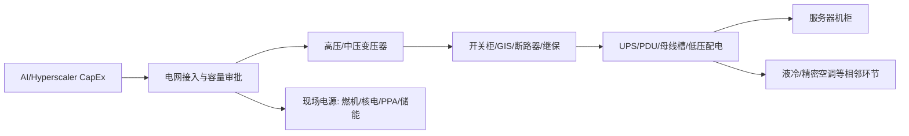

# 数据中心电气瓶颈行业漏斗筛选报告

**报告日期**：2026-07-06  
**数据截止**：北京时间 2026-07-06 20:55；A 股行情为 2026-07-06 16:14 附近；美股行情因美国市场数据源可得性，采用 CNBC 2026-07-02 收盘/盘后快照；财务口径主要采用 2025 年报/10-K；Hubbell 等个别公司 SEC 自动抽取口径疑似不完整，已降为待复核。  
**研究对象**：AI 数据中心扩张中的“电气瓶颈”——不是单纯发电，也不是单纯液冷，而是从电网接入、变压器、开关柜、配电、UPS/PDU、继保调度到机房电源系统的约束环节。  
**方法**：`industry-funnel` 四层漏斗：全市场召回 → 5 条硬指标粗筛 → 结构化精筛 → 四大师框架终选 3 家。  
**重要提示**：本报告用于学习和研究，不构成投资建议；凡标注“估算”的数据需要后续以最新交易所公告/10-Q/公司公告复核。

---

## 0. 摘要：先给结论

### 0.1 终选 3 家

| 公司 | 市场/代码 | 类型 | 推荐度 | 建议仓位（主题内） | 核心逻辑 | 关键风险 |
|---|---:|---|---:|---:|---|---|
| Eaton | NYSE: ETN | 核心 | ★★★★☆ | 40-50% | 全球低压/中压配电、电气系统集成与数据中心电力链龙头，直接卡在“电进机房”的瓶颈位置 | 估值高，2026-07-02 约 398.52 美元，估算市值 1566 亿美元、PE 约 38 倍；若 AI CapEx 放缓会杀估值 |
| 国电南瑞 | SH:600406 | 防守/价值锚 | ★★★★☆ | 25-35% | 中国电网自动化、继保、调度与电力系统数字化龙头；不是最纯 AIDC，但最像“电网瓶颈”的稳定现金流资产 | 数据中心收入占比不透明，增长弹性低于纯设备股；央企/电网订单节奏影响估值 |
| 金盘科技 | SH:688676 | 期权/高弹性 | ★★★☆☆ | 10-15% | 干式变压器+AIDC 主题暴露度高，产品更贴近数据中心内部电气侧，市值小弹性强 | PE 57 倍、PB 7.83 倍，2025 年 ROE 14.05% 尚不足以完全支撑高估值；客户集中与产能爬坡风险 |

### 0.2 高优先级观察名单

| 公司 | 代码 | 为什么没有进终选 | 后续触发条件 |
|---|---:|---|---|
| Vertiv | VRT | 业务非常纯，但 2026-07-02 价格 300.53 美元、估算 PE 86 倍，已经把“AI 电力+热管理”故事打满 | 回撤 30% 以上，或订单/利润继续高增且现金流跟上 |
| GE Vernova | GEV | 电气化+燃机都在瓶颈位，但估算市值 3072 亿美元、PE 63 倍，且业务更复杂 | 电网设备 backlog 与利润率持续改善，估值回落 |
| 思源电气 | 002028.SZ | 海外高压设备优秀，但 PE 41.9、PB 8.46，估值已反映较多成长 | 订单和现金流继续兑现，或估值回到 30 倍以内 |
| 特变电工 | 600089.SH | PE 17.49、PB 1.54 便宜，但业务包含新能源、多晶硅等周期资产，纯度不足 | 变压器订单和毛利成为主要利润来源，周期业务拖累下降 |
| Powell Industries | POWL | 数据中心开关柜弹性强，但规模小、客户/订单周期波动大，SEC 2025 年收入仅约 11 亿美元 | backlog 可见性提升，估值回撤或利润率持续超预期 |

### 0.3 一句话判断

“数据中心电气瓶颈”不是一个无脑买高增长股的赛道。真正稀缺的是：**能把高压电网电力可靠、快速、合规地送进数据中心，并且具备交付能力、认证壁垒、全球渠道和现金流纪律的公司**。当前最好的公司普遍不便宜；因此本报告把 **Eaton** 作为全球核心，把 **国电南瑞** 作为中国电网价值锚，把 **金盘科技** 作为 AIDC 纯度更高但仓位必须小的弹性期权。

---

## 1. 第一层：全市场扫描

### 1.1 产业链位置图

核心瓶颈不是“有没有电”这么简单，而是四个约束叠加：

1. **接入约束**：园区能否拿到足够容量、接入电网、通过审批。
2. **设备约束**：变压器、开关柜、断路器、继保、UPS、母线槽等交付周期长。
3. **系统约束**：数据中心要求高可靠性，设备不是标准工业品堆砌，认证和系统集成重要。
4. **资本约束**：大客户 CapEx 很强，但当估值提前透支时，好赛道也可能不是好股票。

### 1.2 候选池：全球主要上市公司

> 说明：第一层的目标是“不漏掉重要玩家”。其中数据完整的公司进入第二层打分；部分欧洲、日韩与未上市公司先列入观察/待核实池。

| 公司 | 代码 | 市场 | 环节 | 数据中心电气相关性 | 入选类别 |
|---|---:|---|---|---|---|
| Eaton | ETN | 美股 | 低/中压配电、UPS、电气系统 | 高 | A/B/C |
| Vertiv | VRT | 美股 | 数据中心电源、热管理、机柜基础设施 | 极高 | A/B/C |
| GE Vernova | GEV | 美股 | 电气化、变压器、电网设备、燃机 | 高 | A/B/C |
| Powell Industries | POWL | 美股 | 定制开关柜、配电系统 | 高 | B/C |
| nVent Electric | NVT | 美股 | 电气连接、外壳、机柜 | 中高 | A/C |
| Hubbell | HUBB | 美股 | 公用事业和电气解决方案 | 中高 | A/C |
| Quanta Services | PWR | 美股 | 电网工程、EPC、公用事业服务 | 中高 | A/C |
| Constellation Energy | CEG | 美股 | 核电/无碳电源 | 间接受益 | A/B/C |
| Vistra | VST | 美股 | 发电资产、容量电价、PPA | 间接受益 | A/B/C |
| Talen Energy | TLN | 美股 | 核电+数据中心 PPA 弹性 | 高弹性但财务波动 | B/C |
| Schneider Electric | SU.PA | 法股 | 配电、自动化、数据中心电力管理 | 高 | A/C，待补最新数据 |
| ABB | ABBN.SW / ABB | 瑞士/美股 ADR | 电气化、自动化 | 高 | A/C，待补最新数据 |
| Siemens Energy | ENR.DE | 德股 | 输配电、燃机、电网设备 | 中高 | A/C，待补最新数据 |
| Legrand | LR.PA | 法股 | 低压电气、数据中心基础设施 | 中高 | A/C，待补最新数据 |
| HD Hyundai Electric | 267260.KS | 韩股 | 变压器、电力设备 | 高 | B/C，待补最新数据 |
| Hyosung Heavy Industries | 298040.KS | 韩股 | 变压器、重电设备 | 高 | B/C，待补最新数据 |
| LS Electric | 010120.KS | 韩股 | 电力设备、自动化 | 中高 | B/C，待补最新数据 |
| Hammond Power Solutions | HPS.A.TO | 加股 | 变压器 | 高 | B/C，待补最新数据 |
| 国电南瑞 | 600406.SH | A 股 | 电网自动化、继保、调度 | 中高 | A/B/C |
| 思源电气 | 002028.SZ | A 股 | 高压开关、GIS、互感器、海外 | 高 | A/B/C |
| 金盘科技 | 688676.SH | A 股 | 干式变压器、AIDC | 高 | B/C |
| 特变电工 | 600089.SH | A 股 | 变压器、特高压、新能源 | 中高 | A/C |
| 中国西电 | 601179.SH | A 股 | 一次设备、特高压 | 中高 | A/C |
| 平高电气 | 600312.SH | A 股 | 高压开关、GIS | 中高 | B/C |
| 英维克 | 002837.SZ | A 股 | 温控/液冷，非纯电气但数据中心相关 | 高但偏热管理 | B/C |
| 申菱环境 | 301018.SZ | A 股 | 温控/液冷，非纯电气 | 中高 | B/C |
| 科华数据 | 002335.SZ | A 股 | UPS、数据中心电源 | 中高 | 待补数据 |
| 科士达 | 002518.SZ | A 股 | UPS、储能、电源 | 中高 | 待补数据 |
| 盛弘股份 | 300693.SZ | A 股 | 电力电子、充电/储能 | 中 | 待补数据 |
| 麦格米特 | 002851.SZ | A 股 | 电源、电控 | 中 | 待补数据 |

### 1.3 第一层淘汰/降级记录

| 公司/类型 | 处理 | 理由 |
|---|---|---|
| 纯发电商 CEG/VST/TLN | 降为观察 | 数据中心电力需求会推高电源价值，但它们不是“电气设备瓶颈”的第一受益资产，且负债/政策/电价周期更强 |
| 英维克/申菱环境 | 降为观察 | 数据中心相关性强，但偏热管理/液冷，不是本次“电气瓶颈”的主赛道；且估值极高 |
| Schneider/ABB/Siemens Energy/Legrand | 保留观察，不进量化终选 | 公司重要，但本次自动化可复核数据不足；后续可单独补欧洲数据源做第二版 |
| 日韩变压器股 | 保留观察，不进量化终选 | 产业位置重要，但本次未完成可靠行情与财务交叉验证，不能强行排名 |
| 科华数据/科士达/盛弘/麦格米特 | 待补 | 需要进一步拆分 UPS、电源、储能、充电桩收入占比，暂不与纯电气设备龙头混排 |

---

## 2. 第二层：5 条硬指标粗筛

### 2.1 硬指标

| 指标 | 通过标准 | 为什么适合本主题 |
|---|---|---|
| 估值 | 成熟龙头 PE < 45；高增小龙头可放宽至 60；超过 80 只进观察 | 电气设备是好赛道，但仍是制造/工程属性，不能按软件股估值长期外推 |
| ROE | >15% 优先；10-15% 需有确定改善；低于 10% 降权 | 设备制造若没有 ROE，说明议价权或周转不足 |
| 经营现金流 | OCF/净利 >70% 优先 | 数据中心订单很热，但若现金流跟不上，可能只是应收与库存堆积 |
| 资产负债率 | 制造业 <65% 优先；公用事业/工程可放宽但需说明 | 高负债在周期反转时会放大风险 |
| 护城河 | 至少 3 星：认证、品牌、渠道、交付能力、技术、客户粘性 | 数据中心电气是 mission-critical，客户不会轻易换供应商 |

### 2.2 数据完整候选公司体检表

#### 美股候选（行情：CNBC；财务：SEC companyfacts，市值/PE 为估算）

| 公司 | 价格 | 估算市值 | 估算 PE | 2025 收入 | 2025 净利 | ROE | 负债率 | 现金流/净利 | 粗筛结论 |
|---|---:|---:|---:|---:|---:|---:|---:|---:|---|
| Eaton | $398.52 | $1566 亿 | 38.3x | $274.5 亿 | $40.9 亿 | 21.0% | 待复核 | 待复核 | 通过：质量高但贵 |
| Vertiv | $300.53 | $1148 亿 | 86.1x | $102.3 亿 | $13.3 亿 | 33.8% | 67.7% | 0.88x | 观察：纯度高但估值太贵 |
| GE Vernova | $1113.11 | $3072 亿 | 63.0x | $380.7 亿 | $48.8 亿 | 39.7% | 80.5% | 待复核 | 观察：核心资产但估值/负债高 |
| Powell | $246.33 | $29.8 亿 | 58.0x | $11.0 亿 | $0.5 亿 | 8.0% | 42.2% | 3.27x | 观察：小而弹，但 ROE 不够 |
| nVent | $152.15 | $252.6 亿 | 35.6x | $38.9 亿 | $7.1 亿 | 19.0% | 45.6% | 0.91x | 通过/观察：质量可以，纯度略低 |
| Hubbell | $487.10 | $261.6 亿 | 待复核 | 待复核 | 待复核 | 待复核 | 待复核 | 待复核 | 观察：SEC 自动抽取口径异常，需用年报主表复核 |
| Quanta Services | $668.31 | $1009 亿 | 96.9x | $284.8 亿 | $10.4 亿 | 11.5% | 63.8% | 2.14x | 观察：工程服务稀缺，但估值太高 |
| CEG | $239.25 | $734.5 亿 | 31.6x | $226.6 亿 | $23.2 亿 | 15.6% | 74.1% | 1.82x | 观察：电源而非电气设备 |
| VST | $151.05 | $500 亿 | 53.0x | $175.9 亿 | $9.4 亿 | 18.5% | 87.7% | 4.31x | 观察：电源弹性，负债高 |
| TLN | $364.67 | $182.3 亿 | n/m | $25.2 亿 | -$2.2 亿 | -20.0% | 90.0% | n/m | 淘汰/高风险观察：弹性大但财务波动太强 |

> 注：美股市值 = CNBC 价格 × 估算股本。已用 `tools/financial_rigor.py calc` 验算：ETN `398.52 × 393,000,000 / 1e9 = 156.62`；VRT `300.53 × 382,000,000 / 1e9 = 114.80`。精确股本需以最新 10-Q 封面或 shares outstanding 更新。

#### A 股候选（行情：腾讯；财务：东方财富数据中心）

| 公司 | 价格 | 市值 | PE | PB | 2025 收入 | 2025 净利 | ROE | 负债率 | 现金流/净利 | 粗筛结论 |
|---|---:|---:|---:|---:|---:|---:|---:|---:|---:|---|
| 国电南瑞 | 23.16 元 | 1860.15 亿 | 22.36x | 3.74x | 662.29 亿 | 82.79 亿 | 16.26% | 42.73% | 1.54x | 通过：质量、估值、现金流均衡 |
| 思源电气 | 174.20 元 | 1363.24 亿 | 41.90x | 8.46x | 215.39 亿 | 31.50 亿 | 22.63% | 47.05% | 0.71x | 通过/观察：成长优秀但估值偏高 |
| 金盘科技 | 82.74 元 | 380.43 亿 | 57.23x | 7.83x | 72.95 亿 | 6.60 亿 | 14.05% | 57.86% | 0.91x | 通过但限仓：纯度高，估值高 |
| 特变电工 | 21.35 元 | 1078.77 亿 | 17.49x | 1.54x | 973.18 亿 | 59.54 亿 | 8.75% | 55.60% | 1.57x | 观察：便宜但纯度和 ROE 不够 |
| 中国西电 | 14.02 元 | 718.65 亿 | 54.39x | 3.11x | 238.13 亿 | 12.70 亿 | 5.64% | 46.97% | 2.16x | 淘汰：ROE 与估值不匹配 |
| 平高电气 | 17.64 元 | 239.36 亿 | 20.35x | 2.09x | 125.17 亿 | 11.20 亿 | 10.28% | 46.81% | 0.72x | 观察：估值合理，但成长/ROE一般 |
| 英维克 | 74.06 元 | 943.78 亿 | 195.58x | 28.64x | 61.52 亿 | 3.65 亿 | 12.44% | 61.93% | 1.08x | 淘汰：好赛道，估值过度 |
| 申菱环境 | 125.00 元 | 467.85 亿 | 245.02x | 17.30x | 36.73 亿 | 2.10 亿 | 8.41% | 63.23% | 0.66x | 淘汰：估值与质量不匹配 |

> A 股市值验算示例：金盘科技 `82.74 × 459,784,364 / 1e8 = 380.43` 亿元；国电南瑞 `23.16 × 8,031,756,156 / 1e8 = 1860.15` 亿元，与腾讯行情字段一致。

### 2.3 第二层保留/观察/淘汰

| 处理 | 公司 | 理由 |
|---|---|---|
| 保留 | Eaton、国电南瑞、金盘科技、思源电气、nVent | 估值/质量/纯度至少两项达标 |
| 观察 | Vertiv、GE Vernova、Powell、特变电工、平高电气、CEG、VST、Quanta | 赛道位置好，但估值、纯度、负债或周期属性不满足“价值投资硬约束” |
| 淘汰 | 中国西电、英维克、申菱环境、TLN | 本次数据下估值与 ROE/现金流/财务稳健性不匹配，或偏离电气设备主线；Hubbell 因数据口径异常先不排序 |

---

## 3. 第三层：精细分析（核心候选）

### 3.1 Eaton：最像“电气瓶颈收费站”的全球龙头

Eaton 的优势是位置正、产品广、客户信任强。数据中心真正需要的不是单个变压器，而是一整套从中压配电、低压配电、UPS、电气保护到系统集成的可靠方案。Eaton 正好卡在这个环节。对 hyperscaler 来说，电气系统出问题不是“成本超支”，而是“整个机房无法上线”，因此供应商认证、历史交付记录、全球服务网络本身就是护城河。

财务上，2025 年 SEC companyfacts 口径收入约 274.5 亿美元，净利约 40.9 亿美元，ROE 约 21.0%；2026-07-02 CNBC 价格 398.52 美元，按估算股本 3.93 亿股计算，市值约 1566 亿美元，PE 约 38 倍。这个估值不便宜，但相较 Vertiv、GE Vernova、Quanta 的 60-100 倍估值，Eaton 的风险收益更可解释。

反面证据：第一，Eaton 不是纯数据中心股，航空、车辆、电气工业等业务会稀释弹性；第二，估值已经反映“AI 电力瓶颈”预期，一旦 hyperscaler CapEx 或订单能见度下降，估值会先杀；第三，大型电气设备产能扩张后，2027-2028 年供需可能缓和。

结论：Eaton 不是最刺激的股票，但最适合作为该主题的全球核心仓位候选。

### 3.2 国电南瑞：中国电网侧的价值锚

国电南瑞的最大优点是“电网瓶颈”的系统性位置。数据中心要扩张，最终绕不开电网调度、继保、电网自动化、特高压/配网数字化和电力系统稳定性。国电南瑞不一定拿到每一个 AIDC 机房的设备订单，但它受益于整个中国电网为高负荷、高波动、高可靠性需求升级。

数据上，2026-07-06 腾讯行情显示国电南瑞价格 23.16 元、市值 1860.15 亿元、PE 22.36、PB 3.74。东方财富 2025 年报口径显示收入 662.29 亿元、归母净利 82.79 亿元、ROE 16.26%、资产负债率 42.73%、经营现金流/净利约 1.54 倍。这是一组非常“价值投资友好”的指标：估值不低但合理，现金流好，负债低，利润质量高。

反面证据：国电南瑞不是纯 AIDC 暴露，数据中心收入占比不透明，弹性可能远低于金盘科技、思源电气、Vertiv。它的增长更多来自电网投资、调度自动化、电力系统数字化，而不是单一数据中心订单爆发。如果主题资金只炒“液冷/变压器/AIDC”，国电南瑞短期可能跑输。

结论：如果把“数据中心电气瓶颈”理解成长期电网升级，而不是短期概念炒作，国电南瑞是中国资产中最适合做价值锚的一只。

### 3.3 金盘科技：AIDC 纯度更高，但必须小仓位

金盘科技的吸引力在于纯度。干式变压器、数据中心、数字化工厂、AIDC 客户，是更接近“电气瓶颈”终端的资产。与国电南瑞相比，它的弹性更大；与 Eaton 相比，它的市值更小，订单变化对利润弹性更明显。

数据上，2026-07-06 腾讯行情显示金盘科技价格 82.74 元、市值 380.43 亿元、PE 57.23、PB 7.83。东方财富 2025 年报口径收入 72.95 亿元、归母净利 6.60 亿元、ROE 14.05%、负债率 57.86%、经营现金流/净利约 0.91 倍。经营现金流尚可，但 ROE 未超过 15%，估值却已经超过 57 倍，这说明市场已经在为未来 AIDC 订单高增长付费。

反面证据：第一，估值安全边际薄；第二，AIDC 客户订单如果延期，利润弹性会反向放大；第三，干式变压器并非无法扩产的绝对垄断环节，长期竞争格局仍需验证；第四，市值较小，股价波动会更剧烈。

结论：金盘科技适合作为“期权仓”，不适合作为主题核心仓。买它不是因为便宜，而是因为它可能在 AIDC 电气订单确认时有更强弹性。

### 3.4 思源电气：好公司，但价格已不低

思源电气的优势是高压开关、GIS、互感器等产品线，且海外业务成长性较强。2025 年收入 215.39 亿元、净利 31.50 亿元，收入同比 39.34%、净利同比 53.74%，ROE 22.63%，质量很好。问题在估值：2026-07-06 PE 41.90、PB 8.46，现金流/净利 0.71 倍，已经不是“明显便宜”的状态。

结论：思源电气是非常重要的观察股。如果估值回到 30 倍附近，或后续现金流显著改善，可替代金盘科技进入终选；当前更适合观察而非终选。

### 3.5 Vertiv：最纯，但也是最容易被预期反噬

Vertiv 是数据中心电力与热管理基础设施最纯的全球资产之一。问题不是公司不好，而是估值太满：2026-07-02 价格 300.53 美元，估算市值约 1148 亿美元，估算 PE 86 倍。2025 年 SEC 口径收入约 102.3 亿美元、净利 13.3 亿美元、ROE 33.8%，质量很强，但 86 倍 PE 需要持续高增长和利润率扩张来消化。

结论：Vertiv 是“好公司，坏价格”的典型。适合做行业温度计，不适合在当前估值下作为价值投资终选。

### 3.6 GE Vernova：大瓶颈资产，但太贵、太复杂

GE Vernova 同时有电网设备、电气化、燃机等数据中心瓶颈相关资产。若 AI 数据中心推动天然气电厂、电网升级和变压器需求，它会受益。但 2026-07-02 价格 1113.11 美元，估算市值 3072 亿美元，估算 PE 63 倍，已经是“超级叙事资产”。同时，业务复杂、负债率口径较高，不能简单当作纯变压器股估值。

结论：产业位置极强，但当前作为观察股更合适。

---

## 4. 第四层：四大师视角终选

### 4.1 Eaton（ETN）

**段永平视角：是不是好生意？**  
Eaton 的好处是客户买的不是便宜设备，而是可靠性。数据中心电气系统出错，损失远大于设备采购价。客户更在意安全、认证、交付、售后和系统兼容。这使 Eaton 具备一定品牌与渠道溢价。缺点是它仍是制造业，不是边际成本接近零的软件；周期和产能扩张会影响利润率。

**巴菲特视角：现金流和确定性够不够？**  
2025 年收入约 274.5 亿美元、净利约 40.9 亿美元、ROE 约 21%，是成熟工业龙头里较漂亮的质量。估值约 38 倍，不便宜，安全边际主要来自长期确定性而不是当前低估。若用价值投资纪律，应该分批等待，不应追涨 all-in。

**芒格视角：护城河有多宽？**  
护城河来自认证、系统集成、全球客户关系、低/中压配电产品组合和服务网络。数据中心客户很难为了几个点成本更换关键电气供应商。反面是 Schneider、ABB、Siemens、GE Vernova 都是强对手，Eaton 不是垄断。

**李录视角：风险在哪里？**  
主要风险是估值、CapEx 周期和供应链扩产。若市场发现 2027 年供给缓和或 AI 训练效率降低导致电力强度下降，Eaton 这类高质量公司也会估值压缩。

**操作信号**：
- 合理关注区间：PE 30-35 倍以下更舒服；若仍保持高订单和现金流，可适度放宽。
- 仓位：主题内 40-50%，但组合总仓位需另行控制。
- 监测指标：Electrical Americas / Electrical Global 订单、backlog、数据中心订单占比、毛利率、自由现金流。

### 4.2 国电南瑞（600406.SH）

**段永平视角：是不是好生意？**  
电网自动化、继保、调度属于电力系统“神经中枢”。客户集中但需求刚性，项目周期长，产品可靠性要求高。它不是爆发型生意，但有较好的稳定性。

**巴菲特视角：价格是否合理？**  
PE 22.36、PB 3.74，2025 年 ROE 16.26%、现金流/净利 1.54 倍、负债率 42.73%。在 A 股电气设备里，这组指标比多数“AI 概念股”更接近价值投资口径。缺点是成长性不如小市值公司。

**芒格视角：是否有不可替代性？**  
国电南瑞在国内电网自动化和继保调度领域有很强系统地位。数据中心只是电力系统负荷升级的一部分；真正护城河是电网体系内长期积累的工程经验、产品体系、客户关系和安全可靠性要求。

**李录视角：风险在哪里？**  
最大风险是主题错配：如果投资者想买的是“数据中心内部电气设备订单爆发”，国电南瑞不够纯；如果电网投资节奏低于预期，估值也会承压。

**操作信号**：
- 合理关注区间：PE 18-22 倍较有吸引力；超过 28 倍需要更强增长确认。
- 仓位：主题内 25-35%。
- 监测指标：电网投资计划、调度/继保/电力自动化订单、经营现金流、毛利率。

### 4.3 金盘科技（688676.SH）

**段永平视角：是不是好生意？**  
干式变压器与数据中心供电链条直接相关，业务纯度高。但它还需要证明：在需求爆发后，公司能否持续保持毛利率、交付质量和客户粘性，而不是被同行扩产稀释利润。

**巴菲特视角：价格是否合理？**  
PE 57.23、PB 7.83、ROE 14.05%，按传统价值投资并不便宜。买它的理由不是“便宜”，而是未来订单和利润增长可能显著超过当前 2025 年利润基数。因此只能小仓位。

**芒格视角：护城河有多宽？**  
护城河来自客户认证、产品可靠性、交付与数字化制造能力。反面是干式变压器行业并非天然垄断，同行扩产和价格竞争需要警惕。

**李录视角：风险在哪里？**  
最重要风险是订单预期已经资本化。若 AIDC 订单确认慢、客户压价、产能利用率低于预期，估值会快速收缩。

**操作信号**：
- 合理关注区间：PE 40 倍以下更安全；若订单和利润高增，可接受更高但必须限仓。
- 仓位：主题内 10-15%，定位为期权仓。
- 监测指标：AIDC 收入占比、主要客户集中度、在手订单、毛利率、经营现金流/净利。

---

## 5. 综合输出

### 5.1 终选 3 家组合表

| 公司 | 类型 | 推荐度 | 建议仓位 | 核心逻辑 | 关键风险 |
|---|---|---:|---:|---|---|
| Eaton | 核心 | ★★★★☆ | 40-50% | 全球数据中心电气系统龙头，直接受益于配电/UPS/中低压电气瓶颈 | 估值高，制造业周期，AI CapEx 预期反噬 |
| 国电南瑞 | 防守/价值锚 | ★★★★☆ | 25-35% | 中国电网自动化龙头，质量好、现金流好、估值合理 | 数据中心纯度不高，弹性不足 |
| 金盘科技 | 期权 | ★★★☆☆ | 10-15% | 干式变压器+AIDC 纯度高，小市值弹性更强 | PE/PB 高，ROE 未完全匹配估值，订单波动 |

### 5.2 ETF/替代方案

如果不想选个股，可以考虑以下替代思路（仅列方向，不代表买入建议）：

| 类型 | 例子 | 覆盖内容 | 缺点 |
|---|---|---|---|
| 美国工业/电气设备 ETF | XLI、VIS 等 | 工业龙头分散配置 | 数据中心电气纯度低 |
| 清洁电网/电气化主题 ETF | GRID 等 | 电网、输配电、电气化 | 成分复杂，估值差异大 |
| AI 基建宽基 | 半导体+数据中心相关 ETF | 能吃到 AI CapEx 总β | 电气瓶颈权重很低 |

### 5.3 行业位置判断

| 维度 | 判断 |
|---|---|
| 产业阶段 | 从“故事验证”进入“订单兑现”，但股价已经先跑一段 |
| 供需格局 | 2026 年仍偏紧，尤其变压器、开关柜、并网工程、UPS/配电系统；但 2027-2028 年供给扩张可能缓和 |
| 估值位置 | 优质全球龙头普遍偏贵；A 股里便宜资产多不够纯，纯资产多较贵 |
| 最优策略 | 不追最热的纯概念，优先买“好生意+能兑现现金流+估值仍可解释”的资产 |

### 5.4 信息充分度自评

| 维度 | 等级 | 说明 |
|---|---|---|
| 公司财务数据完整性 | B | A 股使用腾讯+东方财富，较完整；美股使用 CNBC+SEC，市值部分使用估算股本；欧洲/日韩未完成量化 |
| 估值数据时效性 | B | A 股为 2026-07-06 实时快照；美股为 2026-07-02 CNBC 快照，需下一个交易日更新 |
| 行业格局判断 | B | 产业链逻辑清晰，但未系统引用全部卖方/行业报告；IEA 等宏观来源需后续补充详细数值 |
| 管理层信息 | C | 本报告是行业漏斗，不含管理层深挖；终选后应对 3 家单独跑 management-deep-dive |

### 5.5 待更新数据点

1. **美股最新 10-Q 股本**：本报告美股市值/PE 使用估算股本，需用最新 10-Q 封面或公司季报精确复核。
2. **Eaton / Vertiv / GE Vernova 最新季度订单与 backlog**：官方 IR 页面部分访问受阻，需用公司新闻稿 PDF 或 SEC 8-K 补齐。
3. **Schneider / ABB / Siemens Energy / Legrand / 日韩变压器股**：本次只做召回，未进入量化排名；若要全球版终极筛选，应补欧洲与日韩行情/财务数据。
4. **AIDC 收入占比**：金盘科技、思源电气、国电南瑞的“数据中心直接收入占比”需要从年报分产品、投资者交流或订单公告进一步拆解。
5. **行业供需**：变压器、开关柜、UPS 交付周期与产能扩张，需要持续跟踪 2026-2027 新产能释放。

### 5.6 资料来源清单

#### 本地生成数据文件

- `data/dc_electrical_ashare_candidates_20260706.csv`：A 股候选行情与财务数据。
- `data/dc_electrical_us_candidates_20260706.csv`：美股候选行情、SEC 财务与估算市值。
- `data/dc_electrical_cnbc_quotes_20260706.csv`：CNBC 快照行情。
- `data/sec_companyfacts_20260706/*.json`：SEC companyfacts 原始数据。

#### 数据源链接

- 日期基线：本地 `Get-Date`，2026-07-06 20:55:32 +08:00。
- A 股行情：腾讯行情接口 `https://qt.gtimg.cn/q=sh600406,sz002028,sh688676,sh600089,sh601179,sh600312,sz002837,sz301018`。
- A 股财务：东方财富数据中心 `https://datacenter.eastmoney.com/securities/api/data/get`，接口类型 `RPT_F10_FINANCE_MAINFINADATA`。
- 美股行情：CNBC quote webservice，例如 `https://quote.cnbc.com/quote-html-webservice/quote.htm?symbols=ETN&output=json`。
- 美股财务：SEC companyfacts API，例如 `https://data.sec.gov/api/xbrl/companyfacts/CIK0001551182.json`、`https://data.sec.gov/api/xbrl/companyfacts/CIK0001674101.json`、`https://data.sec.gov/api/xbrl/companyfacts/CIK0001996810.json`。
- 行业宏观参考：IEA《Energy and AI》页面 `https://www.iea.org/reports/energy-and-ai`。
- 可访问的公司 IR 页面：ABB quarterly results `https://global.abb/group/en/investors/quarterly-results`。

---

## 6. 最后的投资纪律

这个赛道最容易犯的错误是：看到“数据中心缺电”就买所有电力设备股。实际上，电气瓶颈有三类资产：

1. **高质量全球龙头**：Eaton、Schneider、ABB、GE Vernova、Vertiv。问题是贵。
2. **中国电网/输配电质量股**：国电南瑞、思源电气、金盘科技、特变电工、平高电气。问题是纯度、估值和订单兑现差异很大。
3. **电源/工程/热管理相邻股**：CEG、VST、TLN、Quanta、英维克、申菱环境。问题是偏离“电气设备瓶颈”或估值过热。

本报告的结论不是“马上买”，而是：

- 想买确定性：先研究 Eaton。
- 想买中国电网价值：先研究国电南瑞。
- 想买 AIDC 弹性：只小仓研究金盘科技。
- 想追最热纯度：Vertiv、GE Vernova 可以看，但当前更像观察名单而非价值买点。

下一步建议：对 **Eaton、国电南瑞、金盘科技** 分别执行 `investment-team` 或 `investment-checklist`，把订单、管理层、估值情景和买入价格单独拆开。

