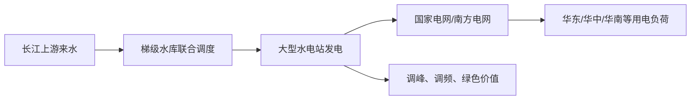

# 长江电力（600900.SH）投资研究报告

> 研究日期：2026-07-07（Asia/Shanghai）  
> 数据截止：财报截至 2026Q1；行情采用腾讯行情 2026-07-06 16:14:49 快照  
> 当前股价：27.19 元；总市值：约 6,652.91 亿元；TTM PE：18.44x；PB：2.92x  
> 研究用途：学习与研究，不构成投资建议。

---

## 0. AI 研究偏见自觉

**信息丰富度评级：A级（信息充裕）**。

长江电力是 A 股大型央企、公用事业龙头、上市时间长、财报披露充分、券商覆盖密集。A级公司的主要风险不是“资料不够”，而是**共识过强**：AI 很容易复述市场已经知道的结论——“水电现金牛、分红稳定、长江稀缺资产”——但忽略两个关键问题：

1. **好生意是否已经被充分定价？** 当前 18.44x TTM PE、2.92x PB，对公用事业并不便宜。
2. **最大变量不是竞争对手，而是来水、电价制度、利率和估值均值回归。**

**AI 研究局限性声明**：
- 财务数据主要来自公司 2025 年年报、2026 年一季报，以及东方财富/新浪/AKShare 同源接口交叉验证；会计数据置信度高。
- 行情来自腾讯实时行情接口；由于研究时间处于 2026-07-07 凌晨，A 股最新有效快照为 2026-07-06 收盘后数据。
- 对未来电价、来水、利率和市场估值中枢的判断属于情景推演，不是事实。

---

## 1. 一屏结论：好资产，当前更像“可持有”而非“高安全边际买入”

**一句话生意本质**：长江电力用长江流域最稀缺的一组大型水电站，把自然来水转化为长期、低边际成本、可分红的清洁电力现金流。

| 项目 | 当前判断 |
|---|---:|
| 公司 | 中国长江电力股份有限公司 |
| 代码 | 600900.SH |
| 核心资产 | 乌东德、白鹤滩、溪洛渡、向家坝、三峡、葛洲坝六座梯级水电站 |
| 可控水电装机 | 7,179.5 万千瓦，其中境内 7,169.5 万千瓦 |
| 2025 发电量 | 3,071.94 亿千瓦时，同比增长 3.82% |
| 2025 营收 | 862.42 亿元，同比增长 2.07% |
| 2025 归母净利润 | 345.03 亿元，同比增长约 6.17% |
| 2026Q1 归母净利润 | 67.61 亿元，同比增长 30.50% |
| 2025 经营现金流 | 605.63 亿元 |
| 2025 估算自由现金流 | 420.74 亿元（经营现金流 - 购建长期资产现金流出） |
| 当前估值 | 27.19 元；TTM PE 18.44x；股息收益率约 4.45%（按 2025 利润归属期 1.21 元/股现金回报测算） |
| 初步建议 | **持仓者可继续持有；空仓者不宜把“好公司”等同于“任意价格买入”，更优买点在约 24 元及以下。** |

---

## 2. 数据源与交叉验证

### 2.1 主要来源

| 类别 | 来源 | 用途 |
|---|---|---|
| 一手财报 | 公司官网/巨潮披露《2025 年年度报告》 | 2025 年营收、利润、现金流、装机、电量、分红政策、风险 |
| 一手财报 | 公司官网/巨潮披露《2026 年第一季度报告》 | 2026Q1 财务数据、股东、控股股东增持进度 |
| 行情 | 腾讯行情接口 `qt.gtimg.cn` | 股价、市值、PE、PB、同行估值快照 |
| 交叉验证 | AKShare 东方财富/新浪财务接口 | 利润表、现金流、资产负债表、分红数据复核 |
| 工具验证 | `tools/financial_rigor.py` | 市值、估值、三情景测算、关键数据交叉验证 |

### 2.2 关键数据交叉验证结果

| 数据点 | 公司公告 | 东方财富/AKShare | 新浪/媒体摘要 | 结论 |
|---|---:|---:|---:|---|
| 2025 营业收入 | 862.42 亿元 | 862.42 亿元 | 862.42 亿元 | 一致 |
| 2025 归母净利润 | 345.03 亿元 | 345.03 亿元 | 345.03 亿元 | 一致 |
| 2026Q1 归母净利润 | 67.61 亿元 | 67.61 亿元 | 67.61 亿元 | 一致 |
| 市值 | 腾讯行情 6,652.91 亿元 | 股价 × 总股本 = 6,652.91 亿元 | — | 0.00% 偏差 |

`financial_rigor.py` 输出确认：市值验算偏差 0.00%；TTM PE 18.44x、PB 2.92x、P/FCF 15.82x、股息率 4.45%。

---

## 3. 第一步：数据收集与经营地图

### 3.1 收入结构：水电主业绝对核心，但“其他业务”已不可忽略

| 2025 分部 | 营业收入 | 营业成本 | 毛利率 | 收入同比 | 成本同比 |
|---|---:|---:|---:|---:|---:|
| 境内水电 | 756.62 亿元 | 258.82 亿元 | 65.79% | +1.59% | -7.30% |
| 其他行业 | 103.23 亿元 | 70.67 亿元 | 31.54% | +5.27% | +9.30% |
| 合计/主营近似 | 859.85 亿元 | 329.49 亿元 | 约 61.68% | — | — |

水电主业贡献了绝大部分收入和更高毛利率，体现出水电资产“一次重资本投入、长期低边际成本运营”的特征。其他业务毛利率明显低于水电，未来若占比上升，需要追踪其是否稀释整体资本回报。

### 3.2 电量与电价

| 指标 | 2025 |
|---|---:|
| 境内六座梯级电站发电量 | 3,071.94 亿千瓦时 |
| 上网电量 | 3,055.55 亿千瓦时 |
| 售电量 | 3,058.09 亿千瓦时 |
| 平均上网电价 | 280.28 元/兆瓦时 |
| 2026 年计划发电量 | 力争 3,060 亿千瓦时（有来水前提） |

核心驱动拆解：

```text
利润 ≈ 来水/调度决定的发电量 × 上网电价 - 折旧/规费/运维 - 财务费用 + 投资收益
```

这不是典型的销量扩张型成长股，而是**资源禀赋 + 调度能力 + 成本与融资管理 + 分红纪律**共同驱动的现金流资产。

### 3.3 五年财务趋势

| 年度 | 营业收入 | 归母净利润 | 经营现金流 | 购建长期资产现金流出 | 估算 FCF | 资产负债率 |
|---|---:|---:|---:|---:|---:|---:|
| 2020 | 577.83 亿元 | 262.98 亿元 | 410.37 亿元 | 36.28 亿元 | 374.09 亿元 | 46.10% |
| 2021 | 556.46 亿元 | 262.73 亿元 | 357.32 亿元 | 34.74 亿元 | 322.58 亿元 | 42.08% |
| 2022 | 688.63 亿元 | 237.26 亿元 | 434.77 亿元 | 124.70 亿元 | 310.07 亿元 | 55.74% |
| 2023 | 781.44 亿元 | 272.45 亿元 | 647.49 亿元 | 124.17 亿元 | 523.32 亿元 | 62.91% |
| 2024 | 844.92 亿元 | 324.96 亿元 | 596.48 亿元 | 146.34 亿元 | 450.14 亿元 | 60.79% |
| 2025 | 862.42 亿元 | 345.03 亿元 | 605.63 亿元 | 184.88 亿元 | 420.74 亿元 | 58.27% |

2020-2025 年：
- 收入 CAGR 约 **8.34%**；归母净利润 CAGR 约 **5.58%**。
- 2022 年后资产负债率明显抬升，反映大型水电资产并表/资本开支后的重资产特征。
- 2023-2025 年经营现金流强劲，但自由现金流会被抽蓄、技改、新能源/工程建设投资周期压低。

### 3.4 2026Q1：短期利润弹性较强，但不要年化外推

| 指标 | 2026Q1 | 同比 |
|---|---:|---:|
| 营业收入 | 181.12 亿元 | +6.44% |
| 归母净利润 | 67.61 亿元 | +30.50% |
| 扣非归母净利润 | 62.37 亿元 | +19.20% |
| 经营现金流 | 117.11 亿元 | -1.15% |
| 总资产 | 5,619.91 亿元 | 较 2025 年末 +0.50% |
| 资产负债率 | 57.33% | 较 2025 年末下降 |

公司披露 2026Q1 利润增长主要来自售电收入增加及所持金融资产浮盈。这里要注意：**利润增速高于经营现金流和扣非利润增速**，不宜简单把 Q1 30.5% 的归母净利增速线性外推为全年增长。

**段永平式追问**：如果不看股价，只看这门生意，未来十年客户还会不会持续需要它的电？答案大概率是“会”；但这并不自动说明任何估值都值得买。

---

## 4. 第二步：商业模式质量 — 这是一台“自然资源 + 资产寿命”的现金流机器

### 4.1 谁付钱，为什么付钱？

长江电力的直接客户高度集中于电网体系。2025 年境内年度销售额中，国家电网约占 68.8%，南方电网约占 31.2%。这在普通行业看似客户集中风险，在电力行业则更多体现为制度化交易结构：电网是电力消纳与跨区配置的核心通道。

客户购买的不是差异化品牌，而是：
- 可大规模稳定输出的清洁电力；
- “西电东送”骨干电源的跨区配置能力；
- 在新型电力系统中具备调峰、调频、顶峰发电和绿色属性的稀缺水电。

### 4.2 这门生意为什么好？

| 维度 | 长江电力表现 | 解释 |
|---|---|---|
| 需求稳定性 | 高 | 全社会用电需求长期存在，水电是基础能源资产 |
| 边际成本 | 低 | 建成后主要成本为折旧、规费、维护和财务费用 |
| 资产寿命 | 很长 | 大型水电站经营周期长，现金流持续性强 |
| 价格弹性 | 中等 | 电价受市场化交易与监管影响，并非完全自主定价 |
| 资本再投入 | 中等偏高 | 现有水电现金流强，但抽蓄、新能源、技改会吸收现金 |
| 分红可预期性 | 高 | 2026-2030 年承诺每年现金分红不低于归母净利润 70% |

### 4.3 为什么不是“无风险债券”？

它不像债券，因为：
- 来水会波动；
- 电价机制会变化；
- 利率上行会影响融资成本和估值折现率；
- 市场可能把它当“高股息资产”重新定价，估值中枢会随利率/风险偏好变化。

**巴菲特式追问**：如果股市关闭 10 年，长江电力的水电站仍会发电、仍能产生现金流；但若买入价格过高，投资者仍可能只得到平庸收益。

---

## 5. 第三步：护城河分析 — 不是品牌护城河，而是不可复制的流域资产护城河

| 护城河来源 | 强度 | 证据与判断 | 未来趋势 |
|---|---:|---|---|
| 资源稀缺 | 极强 | 长江干流/金沙江下游大型梯级水电站不可再复制 | 稳定 |
| 规模效应 | 强 | 境内可控水电装机约占全国水电装机 16% | 稳定至略增强 |
| 调度协同 | 强 | 六座梯级电站联合调度提升综合效益 | 随数字化/预测能力增强 |
| 成本优势 | 强 | 水电边际成本低，2025 境内水电毛利率 65.79% | 取决于折旧、规费、检修和财务成本 |
| 监管/牌照 | 强 | 电力资产运营、跨区送电与电价机制均高度制度化 | 稳定但受政策约束 |
| 定价权 | 中等 | 电价不是完全市场自主定价 | 市场化可能带来机会也带来波动 |
| 技术壁垒 | 中等 | 巨型水电站运营维护技术强，但不是软件式垄断 | 稳定 |
| 网络效应 | 弱 | 用户越多不直接改善产品 | 无 |

**护城河趋势**：过去五年，白鹤滩、乌东德等大型资产进入稳定贡献期，护城河的“资产稀缺性”更清晰；未来五年，若全国统一电力市场能让水电的电能量、调节、绿色环境等多维价值更充分变现，护城河可能从“资源稀缺”扩展到“系统调节价值”。

最可能摧毁护城河的不是某个竞争对手，而是：
1. 极端干旱导致发电量系统性下降；
2. 电价机制长期压低水电回报；
3. 高估值买入后，股息率/PE 被利率环境重估。

**巴菲特式追问**：竞争对手拿 1000 亿能复制长江电力吗？答案接近“不可能”；但监管和自然来水不需要复制它，也能影响它的利润。

---

## 6. 第四步：逆向思考与风险清单 — 聪明人为什么不买？

### 6.1 最强空方观点

空方不会说“长江电力是差公司”，而会说：

> 这是一家优质但已经被充分定价的类债券资产。当前 PE 接近 18-19 倍、PB 接近 3 倍，隐含市场愿意为稳定现金流支付较高溢价。一旦无风险利率或高股息资产风险溢价上行，哪怕利润不差，估值也可能回落。与此同时，来水、电价和资本开支会让自由现金流低于投资者想象。

### 6.2 失败路径表

| 风险路径 | 主观概率 | 影响 | 观察指标 |
|---|---:|---:|---|
| 长江上游来水显著低于多年均值 | 中 | 高 | 三峡/乌东德来水、发电量、季度利用小时 |
| 电力市场化导致平均上网电价承压 | 中 | 中高 | 市场化交易比例、电价、辅助服务收入规则 |
| 利率上行或信用利差扩大 | 中 | 中 | 财务费用、浮动利率债务、10年期国债收益率 |
| 抽蓄/新能源投资回报低于水电主业 | 中 | 中 | 在建工程、资本开支、ROIC、减值迹象 |
| 高股息资产估值均值回归 | 中 | 中高 | PE/PB 分位、股息率与债券收益率利差 |
| 安全生产/大坝/极端天气事件 | 低 | 极高 | 公司安全通报、监管处罚、重大事故 |
| 控股股东/关联交易资本配置偏离中小股东利益 | 低中 | 中 | 关联交易、资产注入估值、增持/减持行为 |

### 6.3 我最可能犯的错

- **把稳定现金流误认为稳定股价。** 公用事业龙头也会有估值波动。
- **把 2026Q1 利润高增误认为长期成长加速。** Q1 有金融资产浮盈因素，应更看重全年电量、电价与现金流。
- **低估资本开支。** 2025 购建长期资产现金流出 184.88 亿元，抽蓄与清洁能源投资会持续吸收现金。

**芒格式追问**：如果未来五年股价不涨，只靠股息，你是否仍满意？如果答案是否定的，当前价格就不算足够便宜。

---

## 7. 第五步：管理层与资本配置 — 更像“系统治理”，不是“创始人英雄主义”

### 7.1 控股与管理层

| 项目 | 情况 |
|---|---|
| 控股股东 | 中国长江三峡集团有限公司，2025 年末持股约 43.47% |
| 董事长 | 刘伟平，同时任三峡集团董事长、党组书记 |
| 总经理 | 刘海波，2025 年起任董事/总经理 |
| 管理层持股 | 年报披露董事和高管个人持股总体很低 |
| 控股股东增持 | 截至 2026Q1，三峡集团已累计增持 161,581,335 股，金额约 44.99 亿元 |

这不是创始人驱动型公司，而是央企体系下的核心能源资产平台。评价管理层应看三件事：

1. **资产运营**：能否稳定安全运营超大型梯级电站；
2. **融资与负债**：能否压低融资成本、管理高负债资产负债表；
3. **资本配置**：能否在水电主业之外避免低回报扩张。

### 7.2 资本配置复盘

| 资本配置事项 | 结果/信号 | 评分 |
|---|---|---:|
| 大型水电资产整合后现金流提升 | 2023-2025 经营现金流维持 596-647 亿元区间 | 8/10 |
| 分红纪律 | 2026-2030 年承诺不低于归母净利润 70% | 9/10 |
| 降财务费用 | 2025 财务费用 93.71 亿元，同比下降 | 8/10 |
| 抽蓄/新能源投资 | 战略必要，但回报率需持续验证 | 6/10 |
| 控股股东增持 | 44.99 亿元已实施，增强信号意义 | 8/10 |

### 7.3 股东友好程度

2025 年年度分红预案为每 10 股派 10 元，现金分红金额 244.68 亿元，占 2025 年归母净利润 70.92%。同时公司披露 2026-2030 年每年现金分红不低于当年归母净利润 70%。这对高股息投资者非常关键：它把“水电现金流”较明确地转化为“股东现金回报”。

**段永平式追问**：如果 CEO 退休，公司还能保持竞争力吗？长江电力的答案偏正面，因为护城河主要来自资产、制度和组织系统，而不是某个个人。

---

## 8. 第六步：行业与文明趋势 — 清洁能源时代的“稳定器”，但不是高速成长赛道

### 8.1 文明趋势：能源系统低碳化与电力市场化

长江电力受益于两个长期趋势：

1. **低碳化**：水电是成熟、规模化、低碳的非化石能源。
2. **电力系统复杂化**：风光比例提升后，系统需要调节能力；大型水电具备调峰、调频、跨区输送价值。

公司年报提到，全国统一电力市场建设推进后，各类型电源和除保障性用户外的电力用户将更充分参与市场，电力资源的能量、调节、环境、容量等价值会更市场化反映。对长江电力而言，这既可能提升水电价值，也可能带来电价波动。

### 8.2 价值链位置



长江电力不是新能源制造商，不承担技术路线快速迭代风险；它更像电力系统中的基础设施平台。缺点是成长速度不会像新兴制造业，优点是生命周期长、现金流可预测性高。

### 8.3 同行估值快照

| 公司 | 代码 | 股价 | 市值 | PE | PB | 备注 |
|---|---|---:|---:|---:|---:|---|
| 长江电力 | 600900 | 27.19 | 6,652.91 亿 | 18.44x | 2.92x | 大水电龙头 |
| 华能水电 | 600025 | 9.23 | 1,719.65 亿 | 20.14x | 2.56x | 水电资产 |
| 国投电力 | 600886 | 13.49 | 1,079.81 亿 | 14.53x | 1.56x | 水火风光混合 |
| 国电电力 | 600795 | 4.74 | 845.41 亿 | 12.53x | 1.38x | 火电/新能源混合 |
| 华能国际 | 600011 | 7.01 | 1,100.44 亿 | 7.91x | 1.73x | 火电属性更强 |
| 中国广核 | 003816 | 3.89 | 1,964.40 亿 | 20.71x | 1.56x | 核电资产 |

长江电力的估值溢价是合理的：资产稀缺、现金流稳、分红明确。但溢价已经存在，投资收益更多依赖“稳定利润 + 分红 + 小幅增长”，而不是估值继续大幅抬升。

**李录式追问**：站在 20 年后看，长江电力大概率仍是中国清洁电力系统的关键基础设施；但它更像“稳定的文明基础设施”，不是“指数级增长平台”。

---

## 9. 第七步：估值与安全边际

### 9.1 当前估值验算

| 指标 | 数值 | 计算/来源 |
|---|---:|---|
| 股价 | 27.19 元 | 腾讯行情 2026-07-06 |
| 总股本 | 244.682 亿股 | 公司财报/腾讯行情 |
| 总市值 | 6,652.91 亿元 | 股价 × 总股本，工具验算偏差 0.00% |
| TTM EPS | 约 1.4746 元 | 2025 EPS 1.4101 + 2026Q1 0.2763 - 2025Q1 0.2117 |
| TTM PE | 18.44x | 工具验算 |
| 每股净资产 | 约 9.313 元 | 2026Q1 归母权益 / 总股本 |
| PB | 2.92x | 工具验算 |
| 2025 FCF/股 | 约 1.719 元 | 2025 估算 FCF / 总股本 |
| P/FCF | 15.82x | 工具验算 |
| 2025 利润归属期现金回报 | 1.21 元/股 | 2025 三季报 0.21 + 2025 年度预案 1.00 |
| 对应股息率 | 4.45% | 1.21 / 27.19 |

### 9.2 反向估值直觉

27.19 元对应 18.44x TTM PE，意味着市场要求并不低。若把长江电力当作“低增长、高分红、强确定性”的资产：

- 若长期 EPS 增长 0-2%，18x PE 已接近合理上沿；
- 若长期 EPS 增长 3-4%，18x PE 可以接受，但安全边际不厚；
- 若遇到来水、电价或利率不利，PE 回到 15-16x 并不奇怪。

### 9.3 三情景估值（工具精算）

假设当前 TTM EPS 1.4746 元，预测 5 年：

| 情景 | EPS 年增速 | 目标 PE | 第 5 年 EPS | 目标股价 | 相对当前 |
|---|---:|---:|---:|---:|---:|
| 乐观 | 4% | 21x | 1.79 | 37.7 元 | +38.6% |
| 中性 | 2% | 18x | 1.63 | 29.3 元 | +7.8% |
| 悲观 | -2% | 15x | 1.33 | 20.0 元 | -26.5% |

若再加上约 4%-5% 的年度现金分红，当前价的长期总回报可以“还不错”，但主要来自分红而非估值便宜。对追求高安全边际的投资者，当前价格并不令人兴奋。

### 9.4 行动价格区间

| 区间 | 对应逻辑 | 动作建议 |
|---|---|---|
| ≤ 21 元 | TTM PE 约 14x；股息率接近/超过 5.8% | 深度价值区，可重点研究加仓 |
| 21-24 元 | PE 约 14-16x；股息率约 5.0%-5.8% | 较有安全边际，适合分批买入 |
| 24-29 元 | PE 约 16-20x；股息率约 4.2%-5.0% | 合理区，持有优于追高 |
| 29-34 元 | PE 约 20-23x；股息率降至约 3.6%-4.2% | 需要更高增长兑现，否则谨慎 |
| ≥ 34 元 | PE 超 23x；高股息吸引力下降 | 可考虑降低仓位或等待业绩上修 |

**段永平式追问**：如果股市明天关闭 5 年，我愿意以 27.19 元持有吗？如果组合目标是稳健收息，可以；如果目标是高赔率增值，不够便宜。

---

## 10. 第八步：综合决策备忘录

### 10.1 六维评分

| 维度 | 结论 | 信心度 |
|---|---|---:|
| 生意质量（段永平） | 稀缺水电现金流，需求长期稳定，资产寿命长 | 高 |
| 护城河（巴菲特） | 流域资源、规模、调度和制度壁垒强 | 高 |
| 管理层（段永平+巴菲特） | 央企系统治理强，分红纪律好；个人持股激励弱 | 中高 |
| 最大风险（芒格） | 来水、电价、利率与高估值均值回归 | 中高 |
| 文明趋势（李录） | 低碳电力与系统调节价值长期有利 | 高 |
| 估值（巴菲特+段永平） | 合理但不便宜；更像持有价，不是重仓捡便宜价 | 中 |

### 10.2 最终决策表

| 投资者状态 | 建议 |
|---|---|
| 空仓者 | 不建议因“好公司”在当前价一次性重仓；可设 24 元以下为主要买入观察区，或用小额定投建立观察仓。 |
| 已持仓者 | 若成本较低、目标是收息和长期稳健，可继续持有；若仓位过重且买入逻辑是“高成长”，应重新审视。 |
| 加仓信号 | 股价跌至约 24 元以下；股息率超过 5%；来水和电价未恶化；资本开支未显著侵蚀 FCF。 |
| 减仓/卖出信号 | PE 超过 22-23x 且利润无明显上修；电价制度持续压低回报；抽蓄/新能源投资 ROIC 低于预期；分红承诺弱化。 |
| 论文重审信号 | 连续两个年度发电量显著低于计划；资产负债率重新上行且财务费用失控；监管改变水电收益分配机制。 |

### 10.3 四位大师模拟点评

> **巴菲特**：这是一条很深的护城河，但投资回报仍取决于你付出的价格。水电站不会逃走，估值却会波动。

> **芒格**：别死在“好公司不会错”的叙事里。反过来想：如果未来收益很一般，原因大概率是买贵了、来水差了、利率变了。

> **段永平**：这家公司大概率是“对的生意”，但“对的价格”要看股息率和长期持有的机会成本。现在不是明显便宜。

> **李录**：它站在能源文明长期演进的基础设施位置上。长期存在感很强，但投资人要区分“文明需要它”和“股价一定跑赢”。

---

## 11. AI 置信度 vs 投资确定性

| 结论类型 | 置信度 | 原因 |
|---|---:|---|
| 2025/2026Q1 财务数据 | 高 | 公司公告、东方财富/新浪接口、工具交叉验证一致 |
| 水电资产稀缺性 | 高 | 六座大型梯级水电站不可复制，装机和电量披露明确 |
| 分红可预期性 | 高 | 公司明确 2026-2030 年不低于归母净利润 70% 分红政策 |
| 当前估值“不便宜” | 中高 | 市值、PE、PB、股息率可验算；但估值中枢取决于市场利率和风险偏好 |
| 未来 5 年 EPS 增速 | 中 | 受来水、电价、财务费用、投资收益影响 |
| 抽蓄/新能源投资回报 | 中低 | 需要后续项目 ROIC 与现金流验证 |

**最终判断**：长江电力是高质量、强护城河、强现金流、强分红纪律的 A 股核心资产；但在 27.19 元、18.44x TTM PE、约 4.45% 股息率的位置，赔率并不极端突出。更适合低成本持有与收息型配置，不适合把“确定性”误读为“高收益”。

---

## 12. 附录：本次使用的本地文件与工具输出

- 官方年报 PDF：`C:\Users\whatn\Desktop\vibecoding\codex\投资分析\ai-berkshire\sources\长江电力\cypc_2025_annual.pdf`
- 官方一季报 PDF：`C:\Users\whatn\Desktop\vibecoding\codex\投资分析\ai-berkshire\sources\长江电力\cypc_2026_q1.pdf`
- 财务工具输出：`C:\Users\whatn\Desktop\vibecoding\codex\投资分析\ai-berkshire\sources\长江电力\financial_rigor_outputs.txt`
- 官方 PDF 下载页/链接：
  - 2025 年报：`https://www.ctg.com.cn/cypc/attachDir/2026/05/2026051815345898336.pdf`
  - 2026 一季报：`https://www.ctg.com.cn/cypc/attachDir/2026/05/2026051815335596092.pdf`
